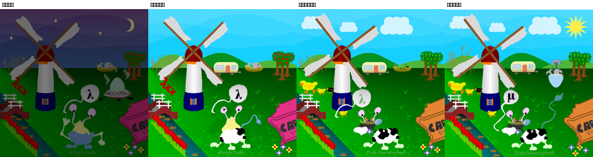

# save-endo-ai

Решение задачи **ICFP Programming Contest 2007 «Morph Endo!»**, сделанное с нуля по спецификации, без интернета и без опубликованных разборов. Решение ведёт ИИ-ассистент (Claude) вместе с человеком: человек задаёт правила и даёт подсказки, ассистент пишет код, ставит эксперименты и ведёт отчёты.



*Слева исходная картинка, затем вчерашний результат, наш текущий результат и target.*

## О соревновании

**ICFP Programming Contest** — ежегодное командное соревнование по программированию при конференции ACM SIGPLAN International Conference on Functional Programming. Задачу каждый год придумывает новая команда организаторов. Решать её можно на любом языке, и на это даётся 72 часа. В 2007 году соревнование проводил Утрехтский университет (Нидерланды).

**Легенда.** Endo — пришелец из расы Фуун. Межзвёздный мусоровоз сбросил его на Землю. При падении Endo и его верный корабль Arrow сильно пострадали, а когда Endo выбрался наружу, в него ещё и попал грузовой контейнер, сброшенный тем же мусоровозом. Земные условия для Endo слишком суровы, и он в коме. Спасти его можно, только изменив его DNA так, чтобы он приспособился к нашей планете. Arrow придумал подходящую форму (картинка target), но подобрать изменения DNA сам не может.

**Что нужно сделать.**
- DNA Фууна — строка из четырёх «оснований» I, C, F, P длиной около 7,5 млн. Она исполняется как программа: каждая итерация читает с начала строки *pattern* и *template*, ищет pattern и заменяет найденное по template. По ходу выполнения появляются *RNA* — команды рисования: цвета, перемещения, линии, заливки, слои.
- RNA рисуют картинку 600×600. Исходная DNA рисует ночную сцену с Endo (source), а нужна дневная сцена с коровой, утками и фургоном (target).
- Ответ — **префикс**, который дописывается в начало DNA. Оценка: `risk = 10 × (число неверных пикселей) + длина префикса`, чем меньше, тем лучше.
- Главная сложность: внутри DNA спрятан целый «геном» из сотен генов, справочник по ремонту, флаги, зашифрованные и намеренно испорченные участки. Задача задумана как головоломка: подсказки разложены прямо в данных.

Полное условие лежит в `doc/Endo.pdf`, картинки — в `doc/Source-image.png` и `doc/Target-image.png` (у нас они 300×300).

## Текущий результат

Лучший префикс — `prefixes/43_compact.dna` (11276 оснований, собирается `tools/build_best.py`), **8 541** неверных пикселей против 359 866 у исходной картинки (точно, по полноразмерному target 600×600 `doc/Target-image-600.png`). Таблица всех префиксов приведена в конце `reports/findings.md`.

Что уже сделано: день вместо ночи, холмы, облака, корова вместо Endo, утки, фургон вместо НЛО, оранжевый ящик, груши, повёрнутые лопасти мельницы, надпись «Endo has morphed!». Солнце теперь правильного цвета. Не готовы: узор в центре солнца, µ вместо λ (буква зашифрована), кит в голубой чашке с фонтаном, хвостик облачка.

## Отчёты

Отчёты пишутся по ходу работы и коммитятся после каждого шага.

| файл | для кого и о чём |
|---|---|
| [`reports/findings.md`](reports/findings.md) | **Находки.** Как устроена DNA Фууна, таблица генов и флагов, справочник по ремонту, шифр (RC4) и ключи, каждое улучшение с картинкой, таблица префиксов со счётом |
| [`reports/process.md`](reports/process.md) | **Как шла работа.** Выбор стека, исполнитель и builder, инструменты анализа, приёмы (журнал происхождения, послойный рендер, дизассемблер, атаки на шифр, починка мутаций), ошибки и уроки |
| [`reports/story.md`](reports/story.md) | **История для ребёнка 7 лет.** Как мы спасали Endo, простыми словами и с картинками |
| [`reports/story_noir.md`](reports/story_noir.md) | **Та же история как детектив** в духе старых романов про частных сыщиков |
| [`CHECKLIST.md`](CHECKLIST.md) | Что обновлять перед каждым коммитом |
| `reports/img/` | отобранные картинки для отчётов (весь перебор остаётся в `out/`) |
| [`NEXT_SESSION.md`](NEXT_SESSION.md) | промпт и план для продолжения работы в новой сессии |

## Структура

| путь | что там |
|---|---|
| `doc/` | спецификация (`Endo.pdf`), `endo.zip` с DNA, source и target |
| `src/dna.cpp` | исполнитель DNA→RNA (персистентный treap, 2–7 с на полный прогон) |
| `src/build.cpp` | builder RNA→PNG 600×600 со слоями |
| `prefixes/` | лучшие префиксы по шагам (`NN_name.dna`) |
| `analysis/` | таблица генов (`gene_table.json/.txt`), все строки DNA (`strings.txt`), граф вызовов, карта проверок флагов, старые карты генов |
| `tools/` | инструменты на Python и C, см. ниже |
| `reports/` | отчёты |

### Инструменты (`tools/`)

| файл | назначение |
|---|---|
| `endo.py` | кодировщики префиксов (`P`, `T`, `nat`, `word`, `lit`), патчи (`set_base`, `write_at`, `kill_instr`, `fix_bases`), склейка `combine`, Adapter (`push_arg`, `adapter_call`, `crypt_call`), запуск и score |
| `batch.py` | параллельный прогон набора префиксов с монтажом |
| `tune.py` | перебор числовых литералов (позиции, размеры, углы) |
| `disasm.py`, `flow.py` | дизассемблер и компактный поток управления гена (вызовы с именами, условия, переходы) |
| `callgraph.py`, `flagrefs.py` | статический граф вызовов; кто какой флаг проверяет |
| `strings.py`, `genetable.py` | расшифровка строк (EBCDIC−64) и таблицы генов из `printGeneTable` |
| `rnatree.py`, `ablate.py` | дерево вызовов по RNA, удаление и изоляция частей сцены |
| `render_genes.py`, `try_genes.py`, `try_slow.py` | вызов генов поверх сцены, монтажи |
| `fcrypt.py`, `c/rc4crack.c`, `c/rc4crack2.c` | шифр FuunTech (RC4) и переборщики ключей (по purchase code и по известному открытому тексту) |

## Сборка и запуск

Нужны компилятор C++17, zlib и Python 3 (pillow и numpy ставятся в `.venv`).

```sh
make data/endo.dna            # распаковать DNA в data/ (или: python3 -c "import zipfile;zipfile.ZipFile('doc/endo.zip').extractall('data')")
make                          # build/dna, build/build (на Linux: make CXX=g++)
gcc -O2 -o build/rc4crack2 tools/c/rc4crack2.c   # по желанию
python3 -m venv .venv && .venv/bin/pip install pillow numpy

# DNA -> RNA -> PNG
./build/dna -o out/endo.rna                       # без префикса
./build/dna -p prefixes/19_text.dna -o out/x.rna  # с лучшим префиксом
./build/build out/x.rna out/x.png

# префикс + рендер + score одной командой
.venv/bin/python tools/endo.py <PREFIX>
```

### Флаги `build/dna`

| флаг | назначение |
|---|---|
| `-p file` / `-s str` | префикс из файла или строкой |
| `-d file` | DNA (по умолчанию `data/endo.dna`; `-` значит пустая) |
| `-o file` | куда писать RNA |
| `-n N` | остановиться после N итераций |
| `-t FROM TO` | трасса итераций в stderr |
| `-L file` | журнал происхождения: проверки (`B`) и копирования (`R`) в координатах исходной DNA |
| `--dump` | вывести оставшуюся DNA в stdout (вместе с `-n` даёт снимок памяти) |

### Флаги `build/build`

`build in.rna out.png [--layers prefix] [--stop N]`. `--layers` выгружает все слои с альфой, `--stop N` останавливается после N команд. Так, например, видна записка-префикс, которую исходная DNA рисует в первых командах и потом закрашивает.

## Проверка

Исполнитель воспроизводит эталон из спецификации: 1 891 886 итераций, 302 450 RNA, cost 192 646 205. Префикс из спецификации даёт экран SELFCHECK, на котором все 25 тестов проходят.
