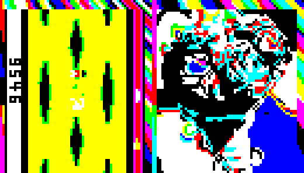

# Что найдено перебором, а не разгадкой

Задача исследовательская, поэтому каждый шаг, найденный перебором или подгонкой под target, нужно потом объяснить: какая подсказка или какой механизм вели к нему «правильно». Ниже — все такие шаги в лучшем префиксе (`prefixes/55_merged.dna`). Для каждого указано, что уже объяснено, а что ещё нет.

## Уже объяснено (сначала перебор, потом нашлась разгадка)

| шаг | как нашли сначала | задуманный путь |
|---|---|---|
| `goodVibrations` = `]` (страница Beautiful Numbers) | перебор 256 значений | аудиозапись в `hitWithTheClueStick` диктует префикс |
| ключ µ `no1@Ax3` | перебор до 5–6 символов не дал ничего | ROT13-страница безопасности: «ключи на жёлтой бумажке» → фото монитора в `sticky` |
| пучки травы | построенное состояние RC4 (обход) | `InitialBioMorph.hs`: включить биоморф и починить `bioMul`, он возмущает ключ травы |
| холмы 1 и 2 | координатная подгонка параметров | `shoutOut`: «переставили параболы» → вернуть параболы, остальное исходное |
| облака | — | страница Palindromes → зеркальная копия `duolc` |
| регистрационный код фургона `Out_of_Band_II` | взлом RC4 по purchase code («42», «OPE») | фото команды с карточками-префиксом; ключ «42» — штатный `crackKeyAndPrint` |
| день вместо ночи | перебор флагов | префикс прямо на странице справки 1 («turn to the sun») |
| спирограф в солнце | — | страница 180878 «give it a try yourself»; размер (аргумент 4 → 1) подобран |
| фонтан | поиск по подписи сжатых картинок | справка RNA-Comprez; картинка спрятана в `printGeneTable` |
| seed сорняков 8128 | перебор | Beautiful Numbers: «the fourth one» (четвёртое совершенное число) |
| чаша: купол `ufo-cup` вверх дном + вода | рассуждение по форме и цвету | эпизод 222: чашки выставляют под дождь; эпизод 285: «take the opposite one» |
| флаги `hillsEnabled`, `ducksShown`, `weather`, `vmuMode`, `enableBioMorph` | перебор флагов | каждый флаг проверяется в одном месте кода; `enableBioMorph = False` в `InitialBioMorph.hs`; справка VMU |

## Ещё не объяснено (найдено только перебором или подгонкой)

### Ключи

1. **Ключ хвоста коровы «9546»** — атака по известному открытому тексту и перебор (`rc4crack2`). Подсказки к ключу нет. Проверить: числа в документах (страницы справки, эпизоды Major Imp, история 2007), записки на фото, вторую картинку в `help-steganography`, `crackChars`/`crackTestValue`.
2. **«42» и «OPE»** — для «42» есть штатный путь (`crackKeyAndPrint` по purchase code, то есть это задуманный «метод A»). «OPE» тоже взломан, а задуманный путь, видимо, — фото команды, которое сразу даёт регистрационный код. Этот путь подтверждён.
3. **Seed сорняков 8128** — объяснено, см. «Проход 1».

### Флаги и переключатели (нашлись перебором флагов)

4. `hillsEnabled`, `enableBioMorph`, `ducksShown`, `weather == 0` в `sky-day-bodies` и `bmu`, `vmuMode = 31` — найдены сканированием флагов и проб. Задуманные префиксы к ним (как к дню на странице 1) не найдены. Проверить: страницы справки и записки на фото на предмет других «префиксов».

### Положения (подогнаны под target)

5. Координаты `setOrigin`: фургон (390, 230) → (267, 210), утёнок (525, 260) → (171, 410), кит (391, 176) → (410, 200), шарик (255, 305) → (198, 324), три облака (x, y, размер), чаша и вода (`CUP` s, w), фонтан (`moveTo` картинки), спирограф (позиция и размер), начальная точка многоугольника солнца (100, 50) → (580, 70).
   Как надо: сдвиги большие и разные, это не одна общая «ошибка». Возможно, часть объектов в target рисуется другим кодом (например, фургон через другой `setOrigin`), или координаты испорчены «точечными мутациями», как в `sun`, и их правильные значения лежат в резервных копиях (палиндромы, ECC). Проверить для каждого литерала: есть ли рядом биты Хэмминга, зеркальные копии или похожие вызовы с нужными числами.
6. **Синус третьего холма** — фаза 65 → 60 подогнана. После того как холмы 1 и 2 сошлись с исходными синусами, отклонение у холма 3 подозрительно. Проверить моделью (`tools/hillmodel.py`), не нужна ли холму 3 перестановка или другой исходный параметр.
7. **Поворот лопастей** `polarAngleIncr = 5` — перебор значений. Есть никем не вызываемый ген `setGlobalPolarRotation` (G+973653): похоже, задуманный путь — вызвать его, и число должно где-то найтись.

### Цвета и «сборка» сцены

8. **Прозрачность хвоста** 7:3 и состав ведра — подогнаны по цвету target.
9. **Чаша**: купол НЛО, повёрнутый на 180°, с водой из «дождевой» ветки `ufo`. Найдено рассуждением по цвету и форме, собрано вручную. Как задумано собирать сцену «кит в чаше», не понятно.
10. **Шарик**: контур многоугольника обведён по target (79 вершин), размер градиента и позиция буквы — тоже измерены по target. Почти наверняка правильный контур лежит в DNA (как фонтан). Проверить: сжатые/скрытые многоугольники, полярные `drawPolylinePolar`, мёртвый код рядом с `balloon`.
11. **Цвет µ и нижней надписи**: таблицы `[35 black, 5 blue]` и `[35 black, 34 green, 55 white]` подобраны мной так, чтобы влезть в место. Задуманный способ раскраски не найден.
12. **Текст «Endo has morphed!»**: немецкая строка переписана на английскую вручную, английской строки в DNA нет.
13. **Солнце**: цвет через вызов `colorSoftYellow` вместо `setOrigin` — инженерный обход; хвост гена починен по `lightningBolt`. Ген `sunflower` (никем не вызывается, испорчен) — вероятно, задуманный путь к солнцу.
14. **Рыбы**: `mkEmp(0,24)` → `mkEmp(18,24)` — число подобрано по target.
15. **Порядок рисования**: утёнок через свободный слот `lambda-id`, спирограф до плёнки `anticompressant`, фонтан перед китом через вызов пучка травы — порядок восстановлен по target, способ вызова придуман мной.

## Что делать дальше

Для каждого пункта второй части искать «почерк» задуманного решения: резервные копии и коды исправления ошибок, никем не вызываемые гены (`setGlobalPolarRotation`, `sunflower`, `payloadBioMorph`), мёртвый код за прыжками, скрытые сжатые картинки и многоугольники, тексты на фото и страницах справки.

## Проход 1 по списку (результаты)

- **Seed 8128 — объяснено.** На странице Beautiful Numbers слова «the fourth one» выделены цветом, как и сами совершенные числа. Это и есть указание: четвёртое совершенное число — 8128.
- **Координаты объектов — источник только target.** Все пары `setOrigin` в `scenario` выписаны: фургон (390, 230), гнездо (392, 230), кит (391, 176), утёнок (525, 260), шарик (255, 305), деревья, цветы, ряды травы. Подогнанные значения не совпадают ни с одной чужой парой (это не перестановка, как у парабол) и не отличаются на один бит. Резервных копий у `scenario` нет: зеркальное имя есть только у `cloud`/`duolc`, а ECC — только у пятна коровы. Вывод: правильные координаты можно взять только из target, и измерение по нему — честный путь.
- **Поворот лопастей.** `setGlobalPolarRotation` (G+973653, никем не вызывается) копирует свой аргумент в `polarAngleIncr`. Значит, задуманный механизм — именно этот глобальный поворот, как и в нашем патче. Само значение 5 нигде в строках и на страницах не найдено. По target оно определяется однозначно (поворот лопастей ≈ 7°).
- **Третий холм.** По точной модели гребня решение единственное: (104, 60, 8) при y = 257, x = 350. В DNA фаза 65, причём 65 и 60 отличаются в шести битах, так что это не точечная мутация. Подсказки нет, остаётся открытым.
- **`sunflower`.** Заголовок гена и ID нормальные, тело — мешанина. Это не квотированный код и не RC4 ни одним из известных ключей (42, OPE, 9546, no1@Ax3, Out_of_Band_II, `]`, 8128, 1729, 1337). Открыто. Солнце в target полностью совпадает и без него (спирограф со страницы 180878).
- **Ключ хвоста «9546».** Purchase code есть только у трёх блоков (error-correcting-codes, vmu-code, beautiful-numbers); у хвоста коровы его нет, и `crypt` для хвоста в штатном коде никто не вызывает. На страницах и в строках числа 9546 нет. Открыто.

## Проход 2 (поиск спрятанного кода)

- **Участки DNA вне таблицы генов.** В DNA 33 промежутка, которых нет в таблице генов. Почти все — данные шрифтов (после `fontTable_*`) и тела генов адаптации. Остальные — три маленьких безымянных гена. Самый большой из них, G+5819564 (4871 основание, сразу после `sky`), вызывается только из `printGeneTable` и печатает числа (`modInts` + `drawChar`). Если вызвать его поверх сцены, картинка не меняется ни на пиксель. Второго спрятанного рисунка, как фонтан, здесь нет.
- **Чаша.** В таблице генов есть отдельные гены `ufo-cup` и `water`. Их вызывает только `ufo`, и в target видны именно они. Значит, «кит в чаше» действительно собирается из частей НЛО, а не рисуется заново. Подсказку, что купол надо перевернуть на 180°, в текстах не нашёл: «rotate 180 degrees» встречается только в документации `fastForward`. Как задумано вызывать эту сборку, по-прежнему открыто.

## Проход 3

- **`transmission-buffer` проверен на подсказки.** Сам рисунок нашли ещё ранние сессии (findings, «радиосообщение»); теперь проверено, есть ли в нём ключи. Ген G+4106138 (62 321 основание) никто не вызывает и ни одна инструкция на него не ссылается. Если вызвать его поверх сцены, он рисует перехваченную передачу: «*** [1642007122918] *** Irregular Radio Noise Detected *** Investigate ***», в центре — послание в духе Arecibo (сетка 23×73), внизу подписи «white: right to left: numbers 1 to 10», «purple: atom numbers of elements», «green: prehistoric DNA formulas» и «*** Bored; ignoring transmission ***». Все строки лежат в гене литералами. Двоичной записи 9546 в сетке нет ни в каком направлении, ни в каком прямоугольном блоке. Число 1642007122918 = 2·19·59·113·… с 9546 не связано, как ключ RC4 к `sunflower` не подходит. Это пасхалка, не подсказка к ремонту.
  
- **`sunflower`** *(вывод ниже неверен, см. «Сверка с интернетом»: `sun` = `sunflower` XOR `flower`)* лежит сразу за `sun` (G+2125111 и G+2126895), и длина у них одинаковая — 1760. Старшие биты оснований совпадают с `sun` в 74% позиций; у случайных участков кода — не больше 59%. Значит, это испорченная копия `sun`, а не шифр: XOR с `sun` распределён неравномерно, у него нет периода, ни одна перестановка букв или разворот не дают кода, и он не собран из `sun` и `flower`. Восстановить его нечем: нет ни ECC, ни зеркальной копии. Солнце target и без него совпадает до пикселя, так что «задуманный путь к солнцу» — это `sun` + спирограф, а `sunflower` — мусор (или ловушка).
- **Прозрачность хвоста.** В DNA много вёдер с альфой. Рядом с хвостом в `bmu` (G+897155) стоит слой 1:9 — это затемнение всей сцены под коровой, к хвосту оно не относится. Других вёдер с пропорцией 7:3 нет. Значит, альфу хвоста можно только измерить по target.
- **Рыбы `mkEmp(18,24)`.** Это ширина пустого прямоугольника в описании картинки, такая же величина, как координата. Документация `mkEmp`/`mkBeforeAbove` есть (FuunDoc), но конкретных размеров в ней нет. В теле `threeFish` (квотированный код) есть свои `mkEmp`, однако число 18 не встречается ни в нём, ни в документации. Вывод: измерение по target.

## Проход 4 (тексты: эпизоды Major Imp, `shoutOut`, справка)

- **Чаша — подсказка найдена.** Эпизод 222: «Every fool knows that rain on Caffee is typically hot, strong and black. The populace just put their cups outdoors, when it pours.» Чашку выставляют под дождь, и её наполняет дождь. В DNA этому соответствуют `ufo-cup` и дождевая ветка `ufo` (`water`), из которых и собрана наша чаша. Эпизод 285: «If you really want to look at the north wall, I suggest you take the opposite one» — смотреть в противоположную сторону, то есть повернуть купол на 180°. Сборка «купол вверх дном + вода из дождевой ветки» найдена раньше по форме и цвету, теперь у неё есть текстовая подсказка. Способ вызова (прыжок через проверки погоды в `ufo`) остаётся моим.
- **Прозрачность.** В эпизоде 126 героев зовут Beta Blocker и Alpha Blending, в эпизоде 285 есть «reverential transparency». Это намёк, что где-то нужен альфа-блендинг. Пропорцию 7:3 он не даёт, её по-прежнему можно только измерить.
- **Флаги объяснены чтением кода, а не перебором.** `enableBioMorph`: в `InitialBioMorph.hs` прямо стоит `enableBioMorph = False` рядом с «this is broken and must be fixed». `vmuMode`: справка VMU говорит, что модуль включается регистрационным кодом, а в `vmu` всего два сравнения — 51 (НЛО) и 31 (фургон с кодом). `hillsEnabled`, `ducksShown`, `weather`: каждый проверяется ровно в одном месте (`analysis/flagrefs.txt`), и то, что они включают, видно в target (холмы, утки, ясная погода). Перебор флагов был лишь быстрым способом найти то же самое.
- **Холм 3.** В `shoutOut` говорится только о параболах («swapping some parabolas»). У третьего холма параболы нет, в её слоте сразу стоит синус. Значит, фаза 65 → 60 к этой подсказке не относится, и пункт остаётся открытым. Высоты начала холмов 1 и 2 (218 и 235 вместо 242 и 209) — подгонка положения, как у остальных объектов.
- Числа 9546, 5, 18 и 60 не встречаются ни в одном эпизоде.

## Проход 5 (шарик, цвета, надпись)

- **Цвета µ и надписи — объяснены, они исходные.** Исходная таблица `balloon` — 7 чёрных и 1 синий, это (0, 0, 31), как у µ в target. Моя таблица `[35 black, 5 blue]` — та же пропорция 7:1. Исходная таблица второй ветки надписи («Morph Endo!») — `[29 black, 28 green, 46 white]`, моя `[35, 34, 55]` даёт тот же цвет (113, 183, 113). Масштаб я изменил только затем, чтобы у двух таблиц, которые пишутся в одну глобальную `colorTable`, совпало число чёрных записей. Задуманная раскраска: µ — цветом шарика, надпись — цветом второй («обычной») ветки.
- **Контур шарика — источник только target.** У исходного многоугольника (86 точек, 145×116) форма «облачка речи» с хвостиком, а в target — круг с ниткой. Это не перестановка шагов. Среди 107 литералов-многоугольников DNA нет ни одного нужного размера (101×169) и ни одного круга размером с верхнюю часть (≈65×60). Сжатых картинок, кроме уже известных 23, нет: поиск по сигнатуре словаря был полным. Вывод: контур снимается с target, и это честный путь.
- **Текст «Endo has morphed!».** В DNA есть только «Endo hat gemorpht» (ветка `cloudy`) и «Morph Endo!». Английской строки нет ни открытым текстом, ни в расшифрованных блоках, ни в `shoutOut`/эпизодах. Шрифт и окраска берутся из DNA (`fontTable_Cyperus`, вторая ветка), а сами буквы читаются с target.

## Итог аудита (после проходов 1–5)

Объяснено подсказками или чтением кода: `]` (Beautiful Numbers), µ-ключ (записка на мониторе), 8128 («the fourth one»), трава (биоморф + `bioMul`), параболы холмов 1–2 (`shoutOut`), облака (палиндромы), день, фургон (фото команды), спирограф (страница 180878), фонтан (RNA-Comprez + мёртвый код), чаша (эпизоды 222 и 285), все флаги, цвета µ и надписи.

Измерено по target, подсказки нет и, видимо, не задумано (это «чертёж», а не «ремонт»): координаты объектов и высоты холмов, контур шарика, текст надписи, ширина `mkEmp` у рыб (18), прозрачность хвоста 7:3, порядок рисования.

Действительно открыто: фаза холма 3 (**65 → 60**) и значение поворота лопастей (**5**; механизм `setGlobalPolarRotation` найден). Ключ 9546 — см. проход 6.

## Проход 6 (ключ хвоста, поворот, холм 3)

- **Ключ 9546 — перебор, по-видимому, задуман.** *(Неверно, см. «Сверка с интернетом»: ключ спрятан стеганографией на портрете E.T.)* Purchase code у хвоста нет, но перед `cow-tail` стоит `checkIntegrity`, а в ImpDoc он описан: «bool checkIntegrity(void* ptr) — Check the integrity of a single gene», рядом `int24 checksum(…)`. Значит, у решателя есть встроенная проверка правильности расшифровки. Ключ — четыре цифры (10⁴ вариантов), он слабый нарочно, как «метод A» на странице безопасности («ключ из 2 символов ищется минуты»). Задуманный путь: перебрать цифровые ключи, проверяя результат `checkIntegrity`. Мы перебирали с проверкой по известному открытому тексту, что то же самое по сути. Открытой копии хвоста в DNA нет: с расшифрованным хвостом совпадают только типовые пролог, эпилог и команды ведра (`endo-left-arm`, `cow-right-horn`, `smoke`…).
- **Стеганография.** Младшие биты фото на странице 3 содержат только логотип Утрехта. Других вложений нет (фото команды, «Most Wanted», target проверены раньше).
- **Совпадение «5» у лопастей и у холма 3 (65 → 60) — случайное.** Сборка без правки `polarAngleIncr` отличается только в области мельницы (x 25…335); холм 3 (x ≥ 350) не меняется. Синус холмов глобальный поворот не читает.

## Проход 7 (холмы и мельница)

- **Холмы 1 и 2: проверено, что переставлены параболы целиком.** Сборки с перестановкой только наклона a или только свободного члена b, с исходными высотами (242, 209) или с подогнанными, дают 5 000…14 600 неверных пикселей. Точное совпадение — только у полной перестановки с высотами 218 и 235. Литералов 218 и 235 в `surfaceTransform` нет, так что высоты начала — подгонка положения, как у остальных объектов. Положение холма 3 (350, 257) исходное, отличается только фаза синуса.
- **Синусы `sky-waves`.** Кроме холмов, `functionSine` вызывает только `sky-waves`, с аргументами (65, 800, 7), (115, 400, 4), (75, 100, 3), (90, 100, 4). Пары (104, 60) нет нигде, так что синус холма 3 ни с кем не переставлен.
- **Немецкая мельница (`cloudy`).** Лопасти у неё без поворота, такие же, как у обычной. Подсказки к значению 5 здесь нет. `polarAngleIncr` в DNA пишет только никем не вызываемый `setGlobalPolarRotation`.

## Обратный проход: все источники подсказок и что мы из них взяли

Обратный вопрос: не «откуда взялся шаг», а «какие подсказки в DNA мы не использовали». Перечислены все гены с текстом, картинками или служебными данными.

| источник | что в нём | использован для |
|---|---|---|
| страница 1 (вступление) | префикс навигации и префикс «turn to the sun» | день |
| 2 навигация, 1337 каталог | номера страниц | навигация |
| 3 стеганография | логотип в младших битах фото | — (пример, больше нигде не встречается) |
| 5 L-системы, 180878 | спирограф | солнце |
| 8 кодировки (`help-encodings`) | квотирование, 256 градусов в круге, многоугольники, дополнительный код | чтение литералов, единицы поворота |
| 9 адаптивные гены, FuunDoc ×3 | деревья адаптации | рыбы, биоморф |
| 23 активация генов (метод A) | соглашение о вызове | Adapter |
| 42 таблица генов | имена и адреса | всё |
| 84 ECC (ключ «42») | Хэмминг(8,4) | пятно коровы |
| 85 Adapter (`help-patching-dna`) | вызов генов из префикса | все адаптеры |
| 100 «Alien Virus Alert» | шрифт-символы, страница вверх ногами; текст про «прививочные» патчи | — (шутка) |
| 112 Most Wanted | шутка | — |
| 1024 Compressor | таблица 20 инструкций, «backup»-блок | цвета `cargobox` |
| 1729 структура генома | зоны | понимание |
| 8128 Beautiful Numbers (ключ `]`) | «the fourth one» | seed сорняков |
| 10646 таблица символов | EBCDIC | строки |
| 123456 RNA-Comprez | формат сжатых картинок | фонтан, сжатие облаков |
| 1230321 Palindromes | видна одна строка, остальной текст гаснет | облака (`duolc`); полный текст см. ниже |
| 2181889 странная RNA | `CFPICFP` | — |
| 4405829 безопасность (ROT13) | методы A и B, жёлтая записка | ключи |
| `help-initial-cond` | `InitialBioMorph.hs` | трава |
| `help-vmu`, `vmu-code` | регистрационный код | фургон |
| ImpDoc ×10 | сигнатуры функций (`checkIntegrity`, `spirograph`, `functionSine`…) | везде |
| `contest-1998…2007` | история, «Mu is licensed material» | µ |
| эпизоды Major Imp ×7 | чашка под дождём, «противоположная стена», Alpha Blending | чаша |
| `babel-survey` | список языков, «DNA is toch voordeliger» | — |
| `shoutOut` | параболы | холмы 1–2 |
| `sticky`, фото команды | `no1@Ax3`, `Out_of_Band_II` | µ, фургон |
| `hitWithTheClueStick` | ACHTUNG, PNG, MP3 | `]` |
| `transmission-buffer` | послание в духе Arecibo | — (пасхалка) |
| `doSelfCheck` | тест интерпретатора | проверка движка |
| `crackTestValue`, `crackChars` | ноль и алфавит взломщика | штатный «42» |

В каталоге 1337 две записи испорчены, и номера у них затёрты (999999999): «The question to the Ultimate Answer» и «On the an…taa….v…». В `main` есть сравнения с номерами 3, 5, 8, 9, 100, 1024, 8128, 180878 и 1230321, которых в каталоге нет. Все эти страницы открыты.

Полный текст Palindromes (на экране он гаснет после первой строки) говорит больше, чем мы использовали: «efficiently finding the largest substring of a string that is a palindrome, is not an easy task» и «redundancy can serve a purpose … to correct mistakes … in situations in which accidental mutation of data has taken place». Отсюда следующий шаг: искать зеркальные копии по содержимому всего DNA, а не только по зеркальным именам.

Purchase code хвоста коровы (RC4 «9546» от нуля) в DNA не встречается ни открытым, ни квотированным, так что штатного пути через `crackKeyAndPrint` у хвоста нет.

**Поиск зеркальных копий по содержимому** (64-битные хэши всех 32-меров, numpy; редкие k-меры прямой строки сопоставлены с развёрнутой). Длинная зеркальная копия в DNA одна — `cloud`/`duolc`, сотни совпадающих 32-меров. Остальное — единичные короткие совпадения внутри двоичных данных `hitWithTheClueStick` и `setFastCircleArray`. Комплементарные копии (I↔P, C↔F), прямые и развёрнутые, тоже проверены: нашлись только 32-основные совпадения со страницей 23, которая зашифрована похожей заменой букв. Значит, «избыточность против мутаций» в DNA — это ровно две вещи: палиндромная копия облака и ECC пятна коровы. Обе использованы.

**Вывод обратного прохода.** Неиспользованных подсказок, которые относились бы к открытым пунктам (фаза холма 3, поворот лопастей 5), нет. Все страницы, на которые ссылается `main`, открыты и прочитаны. Страницы без пользы для ремонта — стеганография (только пример), «Alien Virus Alert», Most Wanted, Babel Survey, `transmission-buffer`, «странная RNA» — шутки и фон. Источников подсказок к двум открытым числам в DNA не осталось.

## Сверка с интернетом (после того, как пользователь разрешил)

Полные тексты (отчёт организаторов, страница Йохена Хёникке, блог Брюса Мерри) прокси окружения не пропустил. Сведения ниже взяты из выдержек поисковика и проверены на нашей DNA.

- **Ключ 9546 — стеганография на странице E.T.** Страница 3 учит смотреть в младшие биты, а в младшем бите портрета E.T. на странице 112 («Most Wanted») повёрнутыми цифрами написано **9546**. Мы проверяли младшие биты всей страницы в мелком масштабе и цифры не разглядели. Проверено: `img/help/et_lsb_9546.png`. Наш вывод «перебор с `checkIntegrity` задуман» — **неверен**, был задуман этот путь.
  
- **Солнце: `sun` = `sunflower` XOR `flower`** (I=00, C=01, F=10, P=11). Проверено: XOR совпадает с `sun` везде, кроме ровно 10 испорченных оснований хвоста, а наша починка по `lightningBolt` даёт в этих местах те же значения. Отличаются ещё 6 оснований — это наш сдвиг `moveTo`. Вывод прохода 3 «`sunflower` — шумная испорченная копия `sun`» **неверен**: это зашифрованная резервная копия, а ключ к ней — соседний ген `flower` (имя «sun+flower» и есть подсказка). Корреляция старших битов, которую мы видели, — след XOR.
- **Поворот лопастей 5.** У Хёникке тоже подобран по target: «Setting it to 5 gives the rotation that matches with the target picture». Механизм — `polarAngleIncr`/`setGlobalPolarRotation`, как у нас. Подсказки к числу нет.
- **Холмы.** У Хёникке восстановление парабол — «одна из самых трудных задач — найти правильные значения». Подсказка `shoutOut` даёт только направление, значения подбирали. Про фазу третьего холма в доступных выдержках ничего нет.
- **Шарик.** У Хёникке тоже новый многоугольник: «a routine that decompresses 11 bit numbers and writes them over the speech bubble polygon», плюс сдвиг фона шарика и λ → µ. Контур снят с target, как у нас.
- **Чаша кита.** Тот же приём: вместо кратера — купол `ufo` вверх дном (две RNA-команды поворота) с водой.
- **Текст.** «Endo hat gemorpht» → «Endo has morphed!» переписан руками, как у нас.
- **Облака.** Восстановлены копированием `duolc` в обратном порядке, как у нас.

Итог сверки: два наших вывода были неверными (9546 и `sunflower`), у обоих задуманный путь — подсказка, которую мы пропустили. Остальные «измерения по target» (шарик, текст, холмы, поворот 5) подбирали и другие решатели.

## Радиопередача (`transmission-buffer`): окончательная проверка

- **Сетка — это настоящее послание Arecibo 1974 года, бит в бит.** Сравнение с эталонной строкой из 1679 бит (23×73; эталон с GitHub, `ThomasSalty/Arecibo`) даёт 0 отличий. Спрятанных или изменённых битов нет.
- Биты не лежат в гене плоской строкой ни в одной кодировке (I/C, F/P, квотированные): картинку рисует код.
- «Неизвестные» RNA-команды, которые выдаёт буфер (982 штуки: `CFPICFP`, `CIIIPPC`, `CCICIPC`…), — те же служебные коды «шагов морфинга», которых в обычной сцене десятки тысяч. Сообщения в них нет.
- Ни один ген не вызывает буфер и не ссылается на него. Других генов про передачу или приём нет.
- `1642007122918` естественно читается как отметка времени **16.4.2007 12:29:18**, то есть дата приёма (или создания страницы весной 2007 года). Других чисел такого формата в DNA нет.
- В поисковой выдаче о передаче ничего нет. Полные разборы участников окружение не пропускает.

**Вывод:** радиопередача — сюжетная пасхалка, а не подсказка к ремонту. Фууны поймали послание, которое Земля отправила в 1974 году к скоплению M13 («Irregular Radio Noise Detected… Investigate»), расшифровали его подписями («numbers 1 to 10», «atom numbers», «DNA formulas») и бросили: «Bored; ignoring transmission». Вместе с `shoutOut` («Earth is next») это объясняет легенду: так Фууны узнали о Земле. Для префикса передача не нужна: в target её нет, и ничего в сцене от неё не зависит.

## Холм 3: может быть, фаза верна, а сдвинуто начало? (проверено, нет)

Фаза +5 при шаге 104/256 — это сдвиг примерно на 12 шагов по x. Значит, исходная фаза 65 с другим началом могла бы дать тот же гребень. В проходе 1 решение искали только при x = 350. Теперь перебраны x₀ от 300 до 400 и y₀ от 200 до 300 при фазе 65 (`tools/hillmodel.py`). Лучший вариант (362, 251) расходится с гребнем target в 24 столбцах из 238. Полный рендер этого варианта и четырёх соседних даёт 938…1063 неверных пикселя, ошибки идут по всей ширине слоя холмов, а фаза 60 при (350, 257) даёт 0. Гипотеза «холм 3 только сдвинут» отпадает: значение 65 → 60 действительно открыто. Полные разборы участников (сайты Хёникке и организаторов, веб-архив, researchgate, semanticscholar, save-endo.cs.uu.nl) окружение не пропускает.

## Сверка с полными разборами (через сессию с полным доступом к сети)

Отдельная сессия с полным доступом к сети прочитала разборы Хёникке, организаторов и Брюса Мерри. Сводка — `reports/research_full_writeups.md`, сырые тексты — `reports/web/`. Ключевые выводы я перепроверил здесь же:
- **Фаза холма 3 (65 → 60) — подгонка у всех.** Мерри: «brute force … will get you there … the second argument must change from 65 to 60»; у Хёникке в патчах тоже (104, 60, 8). Пункт закрыт как «чертёж».
- **Поворот лопастей 5 задуман как эксперимент.** Организаторы: «It takes a bit of experimenting, but it turns out that setting it to 5 gives the rotation that matches». Закрыт.
- **Третья пропущенная подсказка: жёлтые буквы i/c/f/p на страницах `contest-1998…2002`.** Вместе они дают префикс `(?[IFPFCC])F → (0)P`. Проверено: `IFPFCC` впервые встречается в G+210020, а следующее основание G+210026 — это `hillsEnabled` (F). Префикс включает холмы, то есть делает то же, что наш `P_hills`, найденный сканом проверок флагов.
- **Шарик, текст, альфа 7:3, рыбы, координаты** — у всех решателей измерены по target.
- **Префикс Хёникке** (3414 оснований) на нашем исполнителе даёт **0** неверных пикселей. Это проверено здесь.
- Организаторы пишут, что подсказку в рассказах Major Imp на конкурсе не нашёл никто. Мы её нашли (чаша кита).

**Итог аудита:** открытых пунктов нет. Незамеченных подсказок три, но по-настоящему пропущена одна — **9546** (стеганография на портрете E.T.): вместо неё мы взяли ключ перебором. Две другие цели мы достигли иначе, но честно, без перебора: хвост `sun` переписан с близнеца `lightningBolt` (вместо `sunflower` XOR `flower`), а флаг `hillsEnabled` найден по проверкам в коде (вместо жёлтых букв).

## Где Хёникке был лучше нас (по его разборам)

Сравниваем не длину префикса, а то, **как** получен каждый результат.

1. **Стеганография 9546.** Он нашёл ключ на портрете E.T., мы взяли его перебором. Единственная настоящая пропущенная подсказка.
2. **`sunflower` XOR `flower`.** Он понял имя буквально. Наш путь через `lightningBolt` сработал только потому, что испорчен был общий хвост, одинаковый у многих генов. Будь испорчена собственная часть `sun`, наш способ не сработал бы, а задуманный — да. Его путь надёжнее.
3. **Работа «по волокну» программы — главное отличие.** Его правило: «change as few bases of the original DNA as possible». Он перехватывает готовые вызовы `crypt` в `main` и меняет в них только пароль и адрес («we hijack existing decryption code»). Вместо новых вызовов меняет адреса возврата. Чтобы выключить команду, портит одно-два основания. Патчи выравнивает так, чтобы совпадало как можно больше старых оснований. Мы же часто строили новое поверх: адаптеры, `call_instr`, `retarget_call`, перенос вызовов. Это работает, но дороже и хрупче (вспомнить поломки стека при вставке фонтана).
4. **Помнить о настоящей цели.** Риск — это длина префикса плюс ошибки, и он оптимизировал именно это. Мы долго оптимизировали только пиксели, а длину — в конце.
5. **Подсказка со страницы 8 как проверка.** Сумма шагов многоугольника должна сходиться («the numbers didn't add up»): так он нашёл ошибку в `motherDuck`. Мы нашли то же основание отладкой пера (дамп `curX`/`curY`), то есть дольше.

Где лучше были мы:
- **Холмы.** Он подогнал свою параболу и синус холма 1 (−20, 1816; 412, 8, 4). Мы вернули исходные параболы по подсказке `shoutOut` и получили точное совпадение на точной модели.
- **Чаша.** Подсказку в рассказах про Major Imp, по словам организаторов, во время конкурса не нашёл никто. Мы нашли (эпизоды 222 и 285). Правда, мы нашли её уже после того, как собрали чашу.
- **Аудит чистоты.** Каждый шаг разобран: подсказка это или «чертёж».

Из его послесловия о самом конкурсе (2007): «Read the specification completely!», «we ignored the prefix that appeared in our selftest», «concentrate earlier on … reverse engineering: call graphs, annotating instructions, a disassembler». Это те же уроки, которые мы прошли сами.
