# Находки: как спасти Endo

Всё ниже найдено своими экспериментами. Координаты даны в **геномных** адресах: `G+n` = offset `13615 + n` в `endo.dna`. Флаги и патчи, где сказано «offset», указаны от начала `endo.dna`.

## Цель

| сейчас (исходная DNA) | нужно (target) |
|---|---|
|  |  |

- `risk = 10 × неверные пиксели + длина префикса`.
- Различий много: ночь вместо дня, нет солнца, облаков, холмов и фургона, Endo вместо коровы, λ вместо µ, розовый ящик вместо деревянного, другая подпись внизу.
- Score считается приблизительно, по target 300×300 (см. process.md §4).

## Подсказка из спецификации: SELFCHECK

Префикс `IIPIFFCPICICIICPIICIPPPICIIC` раскладывается так: pattern `(?IFPP)F`, template `\0P`. Он находит первое `IFPP` (offset 13699) и меняет следующую `F` на `P`. Вместо картинки рисуется самопроверка, и все 25 тестов проходят, то есть наш симулятор верен.

Вывод: **одно основание `F`/`P` работает как булев флаг** (`F` = выкл., `P` = вкл.).

## Флаги

По журналу происхождения собраны все места, где код сравнивает основание исходной DNA с `P`, а там лежит `F`. Каждое место включалось префиксом `set_base(offset, 'P')`.

| offset | эффект при `P` | полезно? |
|---|---|---|
| 13703 | экран SELFCHECK | нет, диагностика |
| 223641 | **зелёные холмы**, как на target, но поверх лежит полупрозрачный зелёный слой | вероятно, частично |
| 224914 | Endo превращается в **верблюда «OCaml»** | нет (шутка) |
| 224915 | мелкое изменение около гнезда | неясно |
| 835114 | выполнение ломается после 98 итераций | нет |
| 838880 | мельница становится чёрно-красно-жёлтой, внизу меняется текст | нет |

| 223641: холмы | 224914: верблюд | 838880: мельница |
|---|---|---|
| 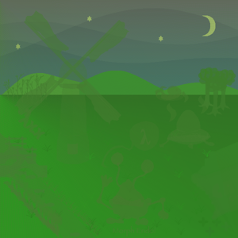 | 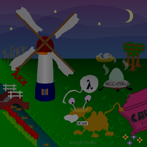 | 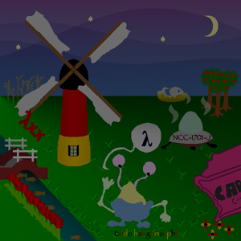 |

## Архитектура генома

- Во время работы DNA устроена так: **[код в начале][геном 7 509 409 оснований][память: стек кадров и переменные]**. Числа хранятся как 24-основные `nat` (23 бита + `P`).
- **Ген** = `[24-слово заголовка][III + 7-основный ID][код …][эпилог]`. На входе ген выдаёт RNA со своим ID: это и есть «неизвестные» RNA-команды, по ним можно трассировать вызовы. Эпилог выдаёт `CFPICFP` и делает return.
- **Вызов**: `!rest(!A(!L)!B)` → `\0 \1 word(ret) word(retlen)`. Остаток текущего гена отбрасывается, `геном[A..A+L]` копируется в начало, в память кладётся кадр (адрес и длина продолжения). **Return** снимает кадр и копирует продолжение. Поэтому у одного гена много «точек входа»: это продолжения после вложенных вызовов.
- **Переход вперёд**: pattern `!N` с пустым template.
- **Глобальные переменные** живут в памяти за геномом и в области данных G+88…833 тыс. Код находит их по маркерам `IFPICFPPCIFF` и `IFPICFPPCIFP`.
- В DNA **250 генов** в 8 цепочках, в обычном прогоне вызывается 89. Между цепочками лежат блоки данных; у пяти из них (G+941304, 2176331, 4377819, 4892517, 5703308) равномерное распределение оснований, **похоже на зашифрованное содержимое**.

### Кто что рисует

`main` G+4536645 вызывает init G+2345486, затем сцену-обёртку G+6530301, затем **exit** G+2248207. Exit не возвращается: он отбрасывает всю DNA до финального маркера, и программа заканчивается.
Обёртка вызывает **сцену G+5033214** (около 40 объектов) и постобработку G+5603524.

Каждый объект рендерился изолированно: из потока RNA оставлялось только поддерево одного гена.

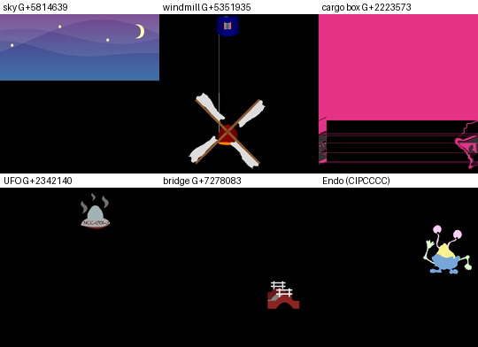

| ген | объект |
|---|---|
| G+5814639 | небо: градиент G+6400641, холмы-силуэты G+4175199, звёзды и луна G+5121803 |
| G+2480640, 2632048 | трава и травинки |
| G+2223573 | розовый ящик «CARGO» |
| G+3966734 | дерево (×3) |
| G+2342140 | НЛО «NCC-1701-J» |
| G+5351935 | мельница |
| G+5075726 | надпись «λxx» |
| G+4522389 | река с рыбами |
| G+7278083 | мост и забор |
| G+4012929 | тюльпаны |
| G+2513052 | гнездо с птицей |
| ID `CIPCCCC` | сам Endo |
| G+2333293 | надпись «Morph Endo!» |
| **G+6628979** | **ночное затемнение** |

### Цвета неба

Ген градиента G+6400641 пишет в память таблицу из 10 чисел `[248, 0, 0, 0, 48, 112, 0, 0, 0, 0]`. Это количества цветов в ведре в порядке black, red, green, yellow, blue, magenta, cyan, white, transparent, opaque. Смесь 248 black + 48 blue + 112 magenta даёт фиолетовый верх ночного неба. Рисует градиент цикл G+5700298 построчно.

## Улучшение 1: ночь → день

Ночной ген G+6628979 первой инструкцией выдаёт `clear`, **44×opaque**, **43×transparent** (alpha около 130), затем заливает весь кадр чёрным через ген прямоугольника G+2217442.

Патч: 44 opaque заменяются копиями соседних transparent, alpha становится 0. Template ссылается на уже существующие RNA, поэтому литералы не нужны: pattern `(!pos)!440(!430)`, template `\0 \1 \1 <transparent>`.

- Префикс `prefixes/01_no_night.dna`, **95 оснований**.
- **359 204 → 215 244** неверных пикселей (−40%).

*Слева исходная картинка, в центре после патча, справа target.*

Не получилось: заглушка всего ночного гена ломает выполнение, потому что ген перекладывает значения в памяти.

## Улучшение 2 (черновое): голубое небо

Таблица цветов неба переписывается без изменения длины: каждое 24-слово в закодированном виде занимает ровно 25 оснований. Подмена `[248,0,0,0,48,112,0,0,0,0]` на `[0,0,0,0,2,0,9,0,0,0]` (2 blue + 9 cyan) даёт **≈201 тыс.** неверных пикселей против 215 тыс.

В target и у нас цвет неба меняется одинаковыми полосами: это полупрозрачные слои холмов поверх базового цвета. Но зелёная компонента почти не реагирует на пропорции, значит, градиент смешивает таблицу с чем-то ещё (G+5700298 и G+4231490). **Не доделано**, префикс не сохранён.

## Скрытая документация (самая важная находка)

Чтобы вызвать произвольный ген, переписывается тело гена **exit** G+2248207: вместо «оборвать DNA» он вызывает нужный ген и возвращается через эпилог другого гена (все эпилоги одинаковые). Так прогнаны все 242 гена (`analysis/gene_sweep.txt`, `tools/try_genes.py`). Многие из них рисуют **страницы справки**.

### ImpDoc: справочник функций, 10 страниц (найдено 9)

| стр. | ген | что там |
|---|---|---|
| 1 | G+2072120 | addInts, beginRelativeMode, checkIntegrity, checksum (offset относительно **Green Zone**), colorBlack/Blue/ByIndex/Cyan/Green |
| 2 | G+5188719 | colorMagenta/Red/White/Yellow, **correctErrors** (коды Хэмминга), **crackKey**, **crypt** (шифрование участков DNA), decInt, div2 |
| 3 | G+6404716 | divInts, drawChar, drawCircleFast, drawEllipse, drawFunction, drawGradientCornerNW/SE |
| 4 | G+4936699 | **drawGradientH/V** (w, h, color), drawHexDigit, drawInt, drawPolyline, drawRect, drawRoundedRect |
| 5 | G+5290123 | drawString (Intergalactic Character Set), endRelativeMode, fadingColors, fastForward, fastRandom, fpForward |
| 6 | G+5125212 | fpMoveAbsolute, fpPop/Push, fpTurnLeft/Right, functionAdd/Parabola/Sine |
| 7 | G+4318821 | ge, incInt, **init** («растит DNA до нужной длины»), initFastRandom, lsystem-kochisland/sierpinski/weed, lt, **makeDarkness** («Cover the whole world in darkness», это ночной ген) |
| 8 | G+3399157 | max, modInts, moveTo, moveToPolar, mulInts, negateInt, **printGeneTable(bool integrityCheck)**, randomInt |
| 9 | G+2525569 | resetOrigin, rotateColor, setGlobalPolarRotation, setOrigin, spirograph, **startup** («DNA entry point»), stringLength, subInts, **terminate** («End the Fuun's suffering», это exit) |
| 10 | G+5107016 | одна функция: `void useColorTable ()`, без описания |

| стр. 7 | стр. 8 |
|---|---|
| 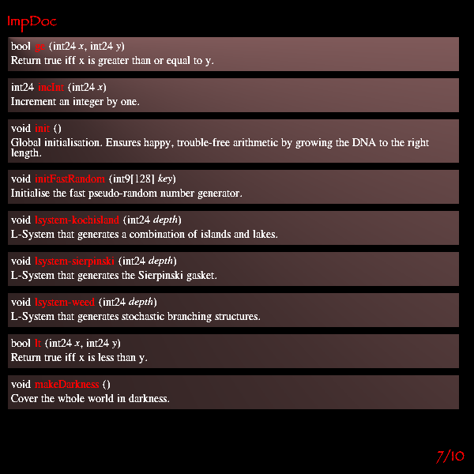 | 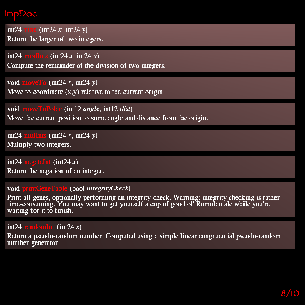 |

Как нашлась 10-я страница: по статическому графу вызовов (`tools/callgraph.py`, `analysis/callgraph.json`) все страницы ImpDoc вызывают одинаковый набор генов: `2217442` (drawRect), `2333293` (drawString), `5431107`, `5708321`, `7170316`. Среди генов, которых никто не вызывает, таких ровно десять, и десятый — G+5107016.

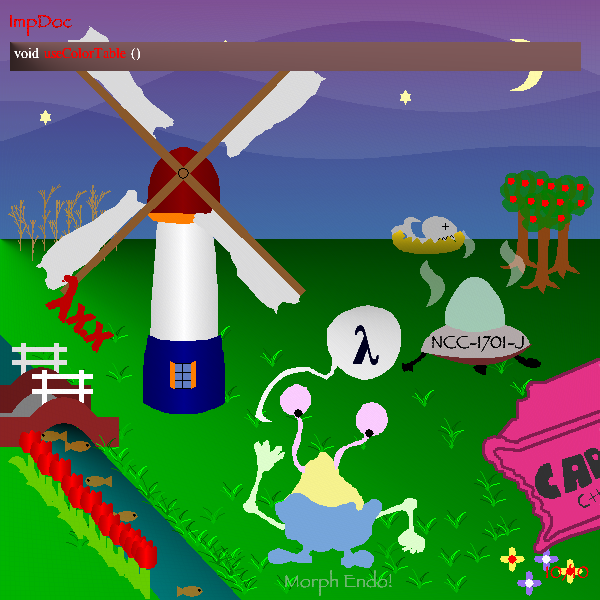

### FuunDoc: «adaptation»-функции, 3 страницы

G+2259442, G+4024238, G+4255241: `activateGene` («Activates the gene whose offset is given in the adaptation trunk residing in the **blue zone**»), `activateAdaptationTree`, `apply1/2_adaptation`, `bioAdd/Mul/Succ/Zero`, `caseVar1/2`, `compose_adaptation`, `goldenFish_adaptation`, `mkGoldfishL/R`, `mkBeforeAbove`, `mkEmp`, `pictureDescrRenderer_adaptation`, `true`/`false`, `var1/var2`.

| | |
|---|---|
| 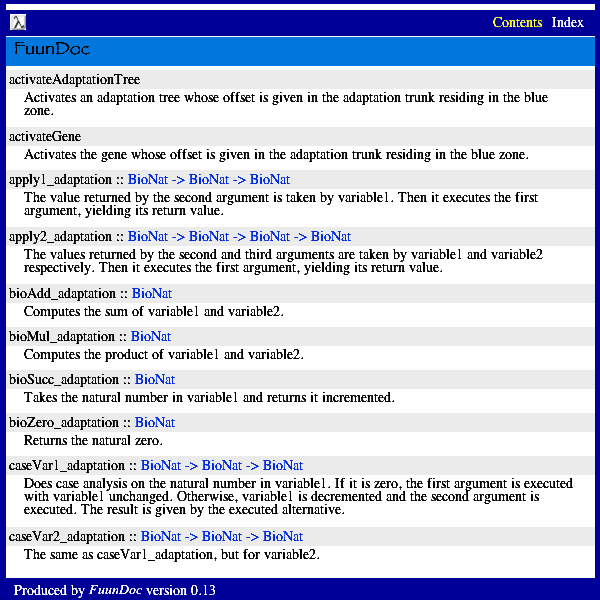 | 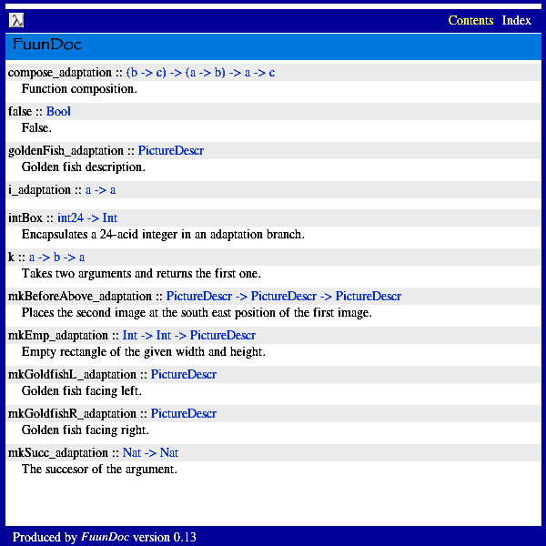 |

### Ещё страницы (найдены по графу вызовов)

- **«Biomorphic initial conditions»** G+4897777: исходник `InitialBioMorph.hs`. В нём `enableBioMorph = False`, `bioAdd` и **`bioMul x y = Zero -- this is broken and must be fixed!!`**. Сказано, что это «компилируется в gene adaptations типа `BioNat = (Nat,Nat) -> Nat`», то есть в функции двух переменных. Связано с FuunDoc (bioAdd/bioMul/bioSucc/bioZero). Похоже, где-то надо починить `bioMul`.
- «Babel Survey» G+5265819: «Languages of Earth … DNA is toch voordeliger».
- «Alien Virus Alert» G+6363166: страница из астрологических значков, возможно, шифр.
- Фото команды ICFP Contest 2007 G+974948 (675 тыс. оснований — это растровая картинка).
- История ICFP Contest 1998–2007, по странице на год: G+1727347, 3463698, 5658071, 5565690, 2389131, 2353998, 2806954, 836126, 4413444, 2131193 (2007 — «Morph Endo!», «First prize: you?»).

| | |
|---|---|
| 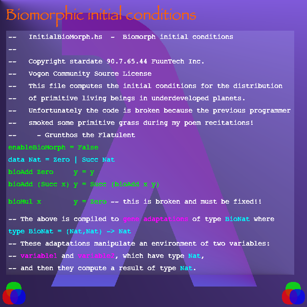 | 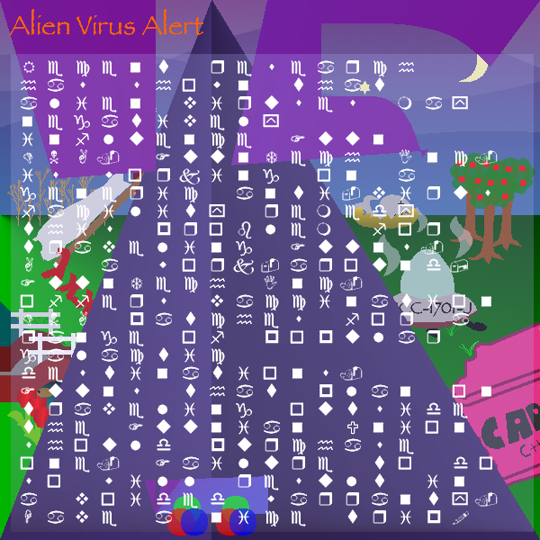 |

### Прочее

- Рассказы «Major Imp's Next Assignment Episode …»: G+2438804, 2592290, 3981275, 4474002, 4537469, 7121559.
- Радиосообщение, похожее на послание Аресибо: «[16420071229 18] Irregular Radio Noise Detected». Ген G+4106138.
- Карта мира: G+2936200. Ещё текстовые страницы: G+1769818, G+3184016, G+3544833.
- **Корова: G+5532935** (нужна для target!). Верблюд: G+5878921. Вероятно, фургон: G+7266762. Что-то жёлтое, возможно, утёнок: G+2477217. Большой «?»: G+7308417.

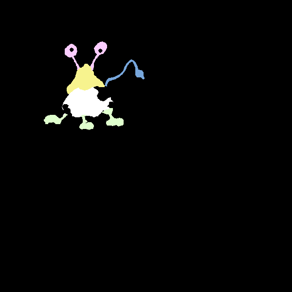 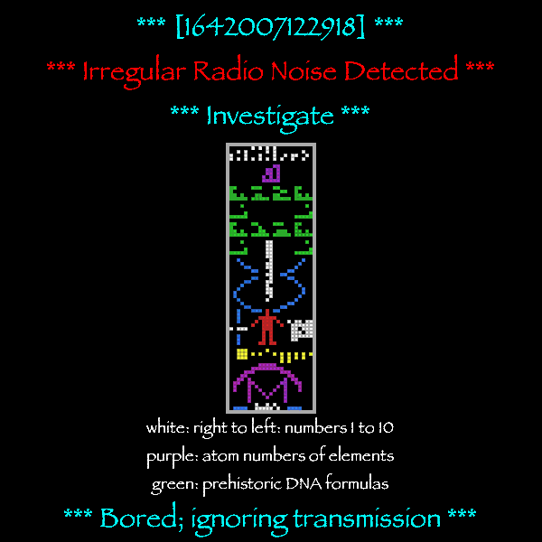

### Гены, упавшие по таймауту (вероятно, ждут аргументов)

1650329, 2209391, 2211015, 2333293, 2483201, 2490158, 2587000, 4526406, 4891684, 5086510, 5286350, 5562217, 5991078, 5995507, 6055539, 6683544, **6686695 (429 тыс. оснований)**, 7115881, 7178892, 7280963, 7294033. Среди них, вероятно, `printGeneTable` (справка предупреждает, что он долгий) и 10-я страница ImpDoc.

## Таблица генов printGeneTable (главный ключ)

- **Строки.** Строковые литералы в шаблонах — это группы по 9 оснований (8 бит, LSB первым, + `P`), терминатор 255. Кодировка: **EBCDIC − 64** (`a`=65, `j`=81, `s`=98, `A`=129, `0`=176, `(`=13). Ключ подобран по тексту страницы 10 (`ImpDoc`, `void`, `useColorTable`, `10/10`). `tools/strings.py` извлекает все 1889 строк DNA (`analysis/strings.txt`).
- **Таблица.** Внутри гена **printGeneTable = G+2640835** (160 449 оснований) лежат данные таблицы: `word(offset) word(size) … имя 255`. Заголовок: «Gene Table — distances relative to green zone start at IFPICFPPCFFPP». `tools/genetable.py` → `analysis/gene_table.json` / `.txt`: **400 имён** (гены, глобальные переменные, флаги).
- **Green zone начинается в G** (offset 13615): смещения таблицы совпадают с нашими G-координатами (`drawRect` 2217442, `drawString` 2333293, `terminate` 2248207, `sky` 5814639, `endocow` 5532935, `main` 6530301). `blueZoneStart` = 7509409, то есть конец генома, где начинается память.
- Найденные раньше флаги получили имена: 223641 = G+210026 = **`hillsEnabled`**, 224914 = G+211299 = **`enableBioMorph`** (верблюд), 838880 = G+825265 = **`cloudy`**.

Флаги и числа из таблицы (значение в исходной DNA):

| имя | G+ | значение |
|---|---|---|
| doSelfCheck | 88 | F |
| helpScreen | 1252 | 0 (int) |
| **night-or-day** | 1295 | **P** (ночь) |
| hillsEnabled | 210026 | F |
| weather | 211275 | 0 (int) |
| enableBioMorph | 211299 | F |
| ducksShown | 211300 | F |
| cloudy | 825265 | F |
| ocamlrules | 823848 | P |

## Улучшение 3: день (`night-or-day` = F)

Одно основание G+1295 `P`→`F`. **134 188** неверных пикселей при префиксе **38 оснований**: небо голубое, без звёзд и луны.

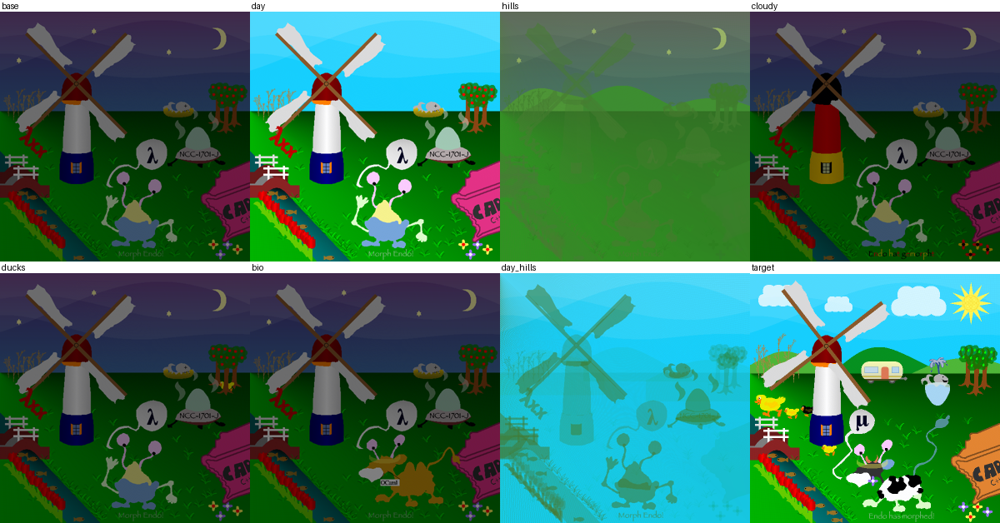

*Сверху: исходная картинка, `night-or-day`=F, `hillsEnabled`, `cloudy`. Снизу: `ducksShown`, `enableBioMorph`, день + холмы, target.*

## Field Repair Manual: глобальная `helpScreen`

`main` (G+6530301) при `helpScreen` ≠ 0 рисует вместо сцены страницу справки. Номер страницы — 24-основное число по адресу G+1252. Страница 2 («Repair guide navigation») сообщает индекс каталога **1337**. Каталог «Catalog seems to be damaged» перечисляет:

| номер | тема | что там |
|---|---|---|
| 1 | вступление | «If you are having difficulty…», жёлтый текст на чёрном |
| 2 | навигация | «take an existing repair guide prefix and replace the encoded integer»; кодировка чисел; «Don't change the length of integers» |
| 3 | стеганография | картинка спрятана внутри другой картинки |
| 5 | Synthesis of complex structures | L-системы |
| 8 | More notes on Fuun Genomics | кодировки: P = True, F = False; числа; строки (9 оснований на символ, 255 в конце); многоугольники |
| 9 | Super adaptive genes | adaptation trees: trunk + branches, green zone |
| 23 | Activating genes **[encrypted]** | зависает |
| 42 | Gene list | printGeneTable, 14 страниц |
| 84 | How to fix corrupted DNA **[encrypted]** | падает |
| 85 | **Field-repairing Fuuns** | штатный **Adapter** для вызова генов из префикса |
| 112 | Some things to look out for | «Intergalactic Most-Wanted List» (шутка) |
| 1337 | этот каталог | |
| 1729 | **Structure of the Fuun Genome** | RED / GREEN / BLUE zone |
| 10646 | Intergalactic Character Set | таблица символов |
| 123456 | RNA compression | «RNA-Comprez», около 2 оснований на RNA-команду |
| 2181889 | Notes on weird RNA | `CFPICFP` означает «часть морфинга сделана», остальные коды начинаются с `C` |
| 4405829 | **Fuun security features** | текст в ROT13, см. ниже |

- **Зоны** (стр. 1729): RED zone — где «всё происходит», рождается из green zone. GREEN zone никогда не меняет размер, её и надо чинить. BLUE zone растёт и сжимается в начале, это наша «память».
- **Adapter** (стр. 85): чтобы вызвать ген, префикс копирует в начало DNA код между маркерами `IFPICFPPCCC`, затем дописывает offset (относительно green zone) и размер гена. Аргументы кладутся в начало Blue Zone, после маркера `IFPICFPPCFIPP`. Результат функции остаётся там же.
- **Безопасность** (стр. 4405829, ROT13): части DNA зашифрованы двумя методами. **Метод A** взломан: ключ восстанавливает «key cracker» (`crackKey`) по 24-основному **purchase code**; ключ из 2 символов ищется минуты, из 3 — дольше. **Метод B** — это RC4: список 0…255, перемешанный ключом; каждый байт потока делится на 4 пары бит и XOR-ится с основаниями (I=0, C=1, F=2, P=3). В таблице генов есть три purchase code: `help-error-correcting-codes_purchase_code`, `vmu-code_purchase_code`, `help-beautiful-numbers_purchase_code`.

| каталог 1337 | структура 1729 | Adapter 85 |
|---|---|---|
|  | 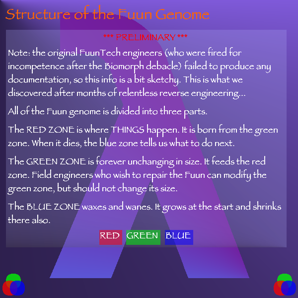 | 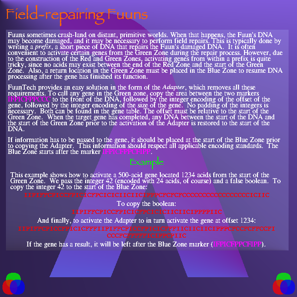 |

## Улучшение 4: холмы (`hillsEnabled` + обезвреживание `surfaceTransform`)

- По статической карте проверок (`tools/flagrefs.py` → `analysis/flagrefs.txt`, кто какую глобальную переменную сравнивает) `hillsEnabled` проверяет только `scenario`. Если флаг `P`, в отдельный слой рисуется `surfaceTransform` (G+7159733): холмы как график функции «парабола + синус», вертикальными линиями.
- **Подвох:** ген распаковывает свой код на лету (самомодифицирующийся шаблон), и первым делом запускает цикл «найти `IIIPIIPICP` (RNA `clear`) → заменить на `IIIPIPIPIF`» **по всему геному**. После этого все 664 последующие очистки ведра перестают работать, цвета накапливаются, и сцена покрывается полупрозрачной зеленью.
- В сыром коде гена литерал поиска хранится дважды квотированным (смещение +119 от начала гена), а литерал замены — трижды квотированным (+329). Достаточно испортить литерал поиска (`…PICP` → `…PICF`), чтобы он ничего не находил.
- Префикс `prefixes/03_day_hills.dna` (**144 основания**): день + `hillsEnabled` + патч поиска. **126 732** неверных пикселей.

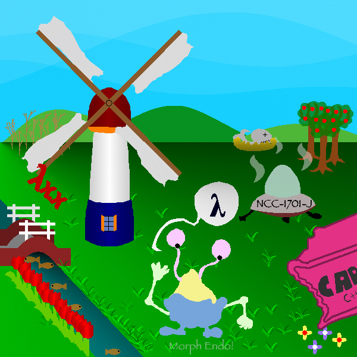

## Улучшение 5: корова (BMU)

- Endo рисует ген **`bmu`** (G+896731, «Biomorphological Unit»; наш сканер слил его с соседним блоком). Логика: если `enableBioMorph`=F, рисуется `endo`. Если P и `weather` ∈ {1, 2}, рисуется **корова**: `cow-*` и `endocow`. Иначе при `ducksShown` рисуется superDuck, при `ocamlrules` — верблюд «OCaml» (поэтому флаг 224914 давал верблюда).
- `weather`=1 даёт дождь, 2 — молнию, а в target погода ясная. Поэтому литерал сравнения `weather == 2` в `bmu` (G+897064) переделан на `== 0`.
- Перед `cow-tail` и `cow-spot-middle` стоит `checkIntegrity`. `cow-tail` (G+4892541) зашифрован (это один из блоков с равномерной статистикой), а для `cow-spot-middle` в DNA лежит `cow-spot-middle-ecc` (G+893863): биты Хэмминга для `correctErrors`.
- Префикс `prefixes/04_cow.dna` (231 основание): **125 112** неверных пикселей. Пока без части пятен.

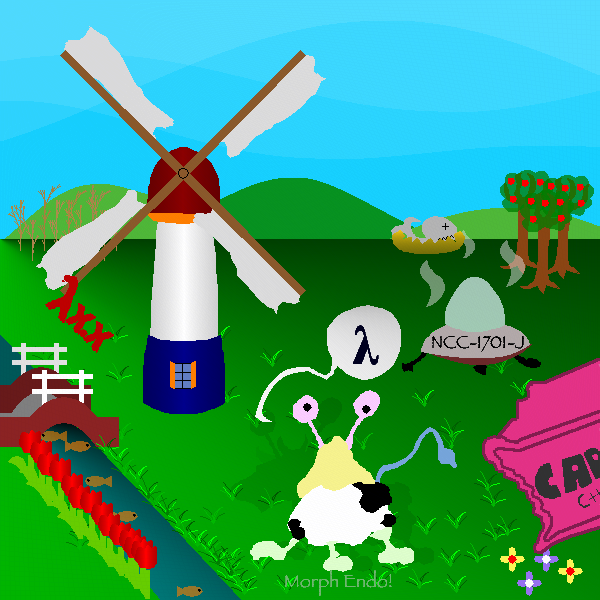

## VMU: НЛО → фургон

`vmu` (G+2342140) при `vmuMode`=51 рисует НЛО, при 31 — фургон: ключом `vmuRegCode` (128 символов, G+210051) расшифровывает `caravan` через `crypt` и вызывает его. Если код пустой, выходит «Please specify your VMU registration code». При других значениях показывается справка `help-vmu`.

## Adapter и подбор ключей

- `tools/endo.py`: `push_arg(bases)` и `adapter_call(offset, size)` — штатный вызов гена через Adapter. Оба побайтно совпадают с примерами на странице 85.
- Зашифрованные блоки, найденные раньше по статистике, — это `help-beautiful-numbers` (G+941328), `vmu-code` (G+2176355), `help-error-correcting-codes` (G+4377843), `cow-tail` (G+4892541), `caravan` (G+5703332).
- `crackKeyAndPrint` (G+7115881) с аргументом purchase code должен подобрать и напечатать ключ.

## Шифр FuunTech = RC4, свой переборщик ключей

- `crackKeyAndPrint` (G+7115881) через Adapter с purchase code `help-error-correcting-codes` за 56 млн итераций напечатал «Key recovered: "42"».
- Расшифровка `help-error-correcting-codes` вызовом `crypt('42', 4377843, 28376)` через Adapter работает: порядок аргументов в Blue Zone такой же, как в сигнатуре. Страница 84 — «Error Correcting Codes», Хэмминг(8,4).
- Дамп DNA до и после `crypt` дал поток ключа. Он **точно совпал с RC4**: ключ — коды символов (EBCDIC−64), каждый байт потока XOR-ится с 4 основаниями (I=0, C=1, F=2, P=3, младшие биты первыми). Итак, «метод A» — это тоже RC4. `tools/fcrypt.py` — та же функция на Python.
- Purchase code — это `crypt(key, word(0))`, то есть первые 6 байт потока RC4. Переборщик `tools/c/rc4crack.c` находит ключи за секунды: **«42»** (error-correcting-codes), **«OPE»** (vmu-code), beautiful-numbers — ключ длиннее 4 символов.
- Страница `vmu-code` (расшифрована ключом «OPE»): «Your registration code: **Out_of_Band_II**». Этот же ключ расшифровывает `caravan`.

| ключ «42» | регистрационный код |
|---|---|
| 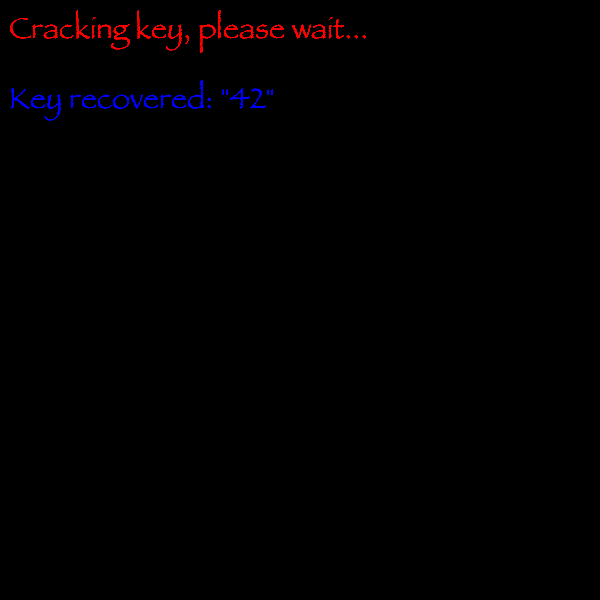 | 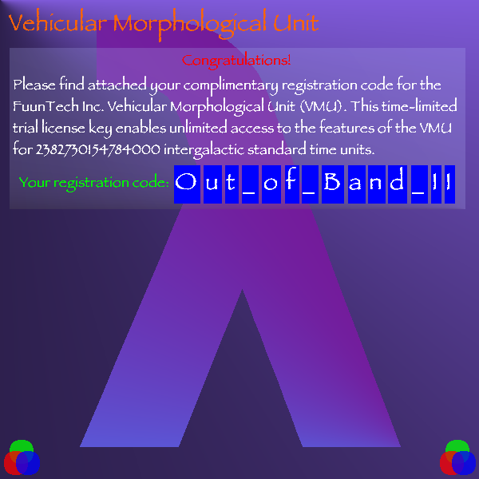 |

## Улучшение 6: фургон

`vmuMode` = 31 (G+210027) и `vmuRegCode` = «Out_of_Band_II» (G+210051, первые 15 символов). Вместо НЛО рисуется фургон. Префикс `prefixes/05_caravan.dna` (499 оснований): **121 240**.

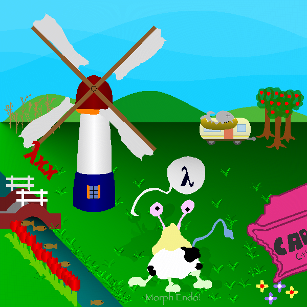

## Улучшение 7: место фургона

Перед `vmu` вызывается `setOrigin(390, 230)`, а в target фургон левее. Литералы координат переписаны на (265, 215): **118 100** при 649 основаниях (`prefixes/06_caravan_pos.dna`).

## Починка `sun` (в префикс пока не включена)

- `sky-day-bodies`: при `weather`==2 рисуются молния и облака, при ==3 — солнце. Сравнения переделываются на `weather`==0 (одно-два основания в литерале).
- Солнце при этом зацикливается: в гене **`sun`** (G+2125111) есть **точечные мутации**. Вызов `drawPolyline` идёт с длиной 23445 вместо 7061 (разница 2¹⁴, один бит). Испорчены также инструкция снятия кадра, шаблон вызова `moveTo`, эпилог и маркер.
- Ремонт: у `lightningBolt` такой же хвост (те же 830 оснований: вызов `drawPolyline`, `moveTo`, эпилог). Хвост `sun` собран из хвоста `lightningBolt`, а адреса возврата и координаты взяты свои. Отличается всего **10 оснований**.
- Солнце рисуется на месте, но чисто жёлтым, а в target оно цвета (251, 236, 73) с узором (вероятно, `sunflower`, G+2126895). При точном подсчёте пикселей выигрыша пока нет.

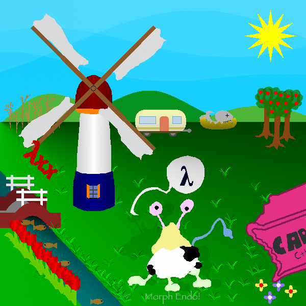

## Улучшение 8: облака из зеркальной копии

- Ген `cloud` (G+6356644) испорчен, а в таблице генов есть **`duolc`** (G+6363166) того же размера 6498. Прочитанный задом наперёд, он совпадает с `cloud` везде, кроме 55 одиночных оснований, и дизассемблируется чисто. Это зеркальная резервная копия; страница «Palindromes» намекала: «READING BACKWARDS».
- 55 исправлений перенесены в `cloud` (близкие объединены в одну запись, `fix_bases` в `tools/endo.py`). Облака включены сравнением `weather`==0 в `sky-day-bodies`; молния остаётся выключенной.
- Побочный эффект: `cloud` ставит флаг `cloudy`=P, а он включает немецкую мельницу, цветы и надпись. Адрес записи сдвинут на соседний безвредный (младший бит в `(!831561)`).
- `prefixes/07_clouds.dna` (2759 оснований после минимизации: 6 из 47 исправлений не влияют на результат): **114 368**.

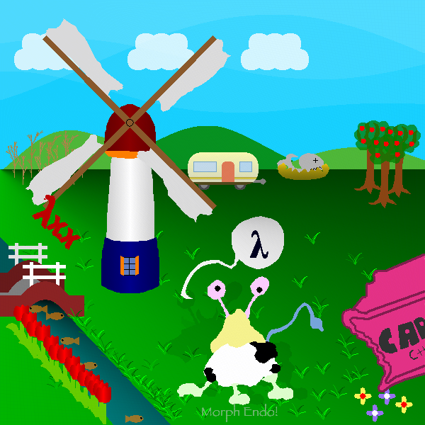

## Улучшение 9: оранжевый ящик

У ящика R совпадает с target, а G и B поменяны местами: (226, 49, 133) против (226, 132, 50). `cargobox` рисует сжатыми RNA (страница «Compressor»: таблица из 20 инструкций по 32 основания). В таблице в начале гена (G+2223573+600…) стоят `magenta` и `green`. Если заменить их на `yellow` и `blue`, каналы как раз меняются местами. Это 3 основания. `prefixes/08_box.dna` (2854): **105 448**.

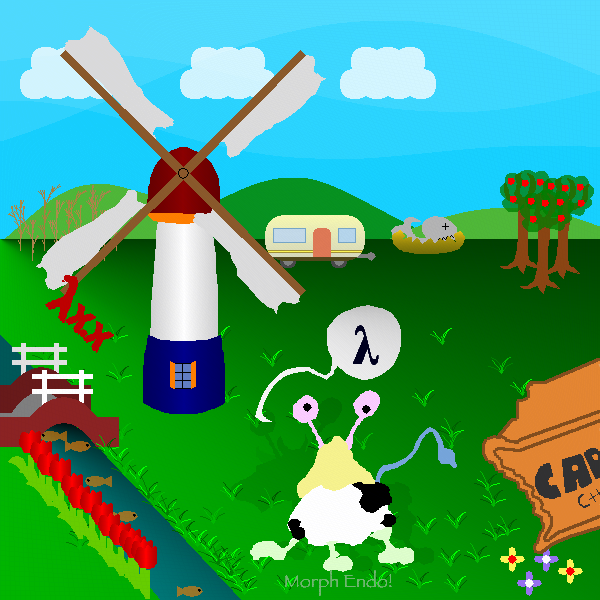

## Улучшение 10: груши вместо яблок

`peartree` (G+5800492) — копия `appletree` того же размера, только вызывает `pear`. В трёх вызовах `appletree` в `scenario` адрес и остаток перекодированы (числа в DNA дополнены нулями до фиксированной длины, длина инструкции сохраняется). `prefixes/09_pears.dna` (3268): **105 148**.

## Улучшение 11: настоящая корова (без гибрида `endocow`)

- Отрисовка со всеми слоями (`build --stop N --layers`) показала, что `bmu` рисует **две** коровы. Первая — та, что в target (котелок вместо головы, рожки, глаза-антенны, пятна). Сверху её закрывает гибрид `endocow` с жёлтой «шапкой» Endo.
- Почему первой не видно: перед частями коровы `bmu` создаёт слой «тени» (`ADD clear opaque transp×9 fill`, чёрный, alpha 25). Потом `COMPOSE, CLIP, COMPOSE` (G+914540…914560): `CLIP` использует корову как маску для тени, и сама корова пропадает, остаётся бледный силуэт.
- Патчи: `opaque`→`transp` в заливке тени (G+897164, 1 основание: тень становится полностью прозрачной), `CLIP`→`COMPOSE` (G+914553, 2 основания), вызов `endocow` (G+914970) заменён пустой инструкцией той же длины (185).
- `prefixes/10_cow_real.dna` (3604): **94 148**. Плюс `correctErrors` для `cow-spot-middle` — `prefixes/11_cow_spots.dna` (3894): **93 120**.
- **Хвост:** `cow-tail` зашифрован, ключ **«9546»** найден атакой по известному открытому тексту. Все гены коровы начинаются с `III`+ID+`III PIIPICP`+`III PIPII…`; это даёт около 38 бит потока RC4, и `tools/c/rc4crack2.c` (переборщик с масками) находит ключ за 50 с. Хвост рисуется, но ярче, чем в target, а расшифровка через Adapter стоит 1544 основания, поэтому в префикс не включена.

## Префиксы

| файл | длина | ≈неверных px | что делает |
|---|---|---|---|
| (пустой) | 0 | 359 204 | исходная картинка |
| `IIPIFFCPICICIICPIICIPPPICIIC` | 28 | — | SELFCHECK |
| `prefixes/01_no_night.dna` | 95 | 215 244 | убирает ночь |
| `prefixes/02_day.dna` | 38 | 134 188 | флаг `night-or-day` = F |
| `prefixes/03_day_hills.dna` | 144 | 126 732 | + холмы, обезврежен `surfaceTransform` |
| `prefixes/04_cow.dna` | 231 | 125 112 | + `enableBioMorph`, корова при ясной погоде |
| `prefixes/05_caravan.dna` | 499 | 121 240 | + VMU: фургон вместо НЛО |
| `prefixes/06_caravan_pos.dna` | 649 | 118 100 | + фургон на месте из target |
| `prefixes/07_clouds.dna` | 2759 | 114 368 | + облака (починка `cloud` по зеркальной копии `duolc`) |
| `prefixes/08_box.dna` | 2854 | 105 448 | + оранжевый ящик (таблица распаковщика) |
| `prefixes/09_pears.dna` | 3268 | 105 148 | + груши вместо яблок |
| `prefixes/10_cow_real.dna` | 3604 | 94 148 | + настоящая корова вместо гибрида |
| `prefixes/11_cow_spots.dna` | 3894 | 93 120 | + пятно `cow-spot-middle` (ECC) |

_(файл обновляется по мере исследования)_
