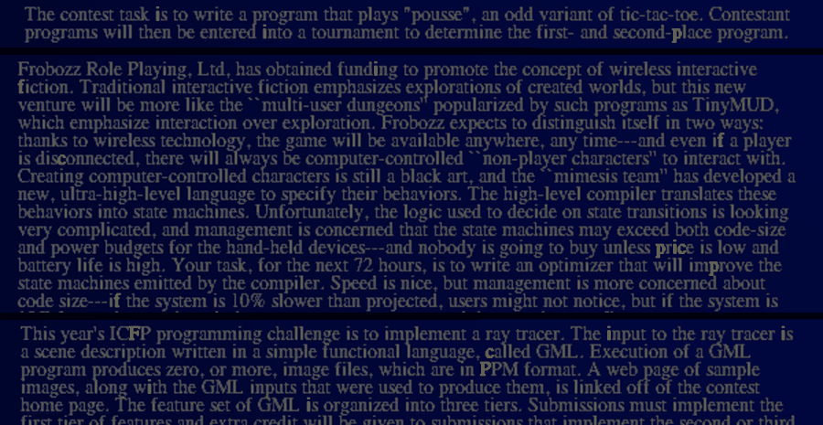

# Сверка с полными разборами (сессия с полным доступом в интернет)

Сессия с полной сетью (ветка `claude/youthful-planck-3zi41n`) прочитала разборы, которые прошлой сессии прокси не пропускал. Каждый вывод проверен на нашей DNA. Сырые тексты источников лежат в `reports/web/`.

## Доступ (2026-10-05)

| URL | код |
|---|---|
| https://nas.jochen-hoenicke.de/icfp07/prefix.html | 200 (текст: `web/hoenicke_prefix.txt`) |
| https://jochen-hoenicke.de/icfp07/postmortem.html | 200 (`web/hoenicke_postmortem.txt`) |
| https://edolstra.github.io/pubs/icfp-contest-report.pdf | 200 (`web/organizers_report.txt`) |
| http://blog.brucemerry.org.za/2021/04/disassembling-endo-part-1.html | 200 (`web/merry_part1.txt`) |
| http://blog.brucemerry.org.za/2021/05/disassembling-endo-part-2.html | 200 (`web/merry_part2.txt`) |
| http://tom7.org/icfp2007/ | 200, страница-заглушка (200 байт) |
| hoenicke.ath.cx, save-endo.cs.uu.nl | недоступны (прокси / DNS); у веб-архива есть только страницы контеста |

## 0. Префикс Хёникке на нашем исполнителе

- **Источник:** «This page describes my current record of a 3404 bases prefix» ([prefix.html](https://nas.jochen-hoenicke.de/icfp07/prefix.html)).
- **Проверка:** полный префикс из раздела «The full prefix» (`web/hoenicke_prefix.dna`; после фильтра по ICFP получилось 3414 оснований, в тексте страницы есть лишние буквы) → `./build/dna -p … && ./build/build …` → `score()` по `doc/Target-image-600.png` = **0** неверных пикселей (5 987 323 итерации, 24 с). Наш исполнитель, builder и метрика сходятся с чужим решением.
- **Таблица патчей:** записи «смещение:длина основания» в разделе «Patch Table» — это смещения от G (13615). Проверено: `0x50f` = 1295 = наш `night-or-day`. Я разобрал 133 записи и наложил их на исходную DNA, чтобы читать значения литералов.

## 1. Фаза синуса холма 3 (65 → 60) — закрыто, это подгонка

- **Merry, часть 2:** «The third hill is trickier. You can almost make it match by changing both the x and y positions, but there are always a few pixels that don't quite match. I don't know if there is a clever way to determine the solution (maybe analysing functionSine to determine the meaning of the parameters and then fitting them), but brute force (automatically trying multiple values) will get you there if you know that only one of the parameters is wrong. In fact, the second argument must change from 65 to 60.» ([part 2](http://blog.brucemerry.org.za/2021/05/disassembling-endo-part-2.html))
- **Хёникке:** «Restore the parabolas that draw the hills. It was one of most difficult tasks to find the right values for them.»
- **Проверка на нашей DNA:** наложил патчи Хёникке и прочитал литералы `HILL_LITS` (из `tools/build_best.py`):

| литерал | исходная DNA | Хёникке | у нас |
|---|---|---|---|
| h2 moveTo | 200, 209 | 200, 235 | 200, 235 |
| h3 moveTo | 350, 257 | 350, 257 | 350, 257 |
| **h3 sine** | 104, **65**, 8 | 104, **60**, 8 | 104, **60**, 8 |
| h1 y | 242 | 218 | 218 |
| h1 parabola | −28, 3348 | −20, 1816 | −21, 1848 |
| h2 parabola | −21, 1848 | −28, 3348 | −28, 3348 |
| h1 sine | 408, 7, 4 | 412, 8, 4 | 408, 7, 4 |
| h2 sine | 328, 13, 3 | 328, 13, 3 | 328, 13, 3 |

  Фаза 60 совпадает. Наш вывод «сдвигом не компенсируется» Мерри получил сам («always a few pixels»). Подсказки к числу нет ни у кого.
- **Попутно:** холм 1 у Хёникке подогнан своей параболой и синусом, а не перестановкой, но гребень по пикселям тот же. Мерри делает, как мы: меняет параболы местами, высоты 242 → 218 и 209 → 235 («merely at the wrong heights»; подобраны наложением слоёв в GIMP).

## 2. Поворот лопастей 5 — закрыто, так задумано

- **Организаторы:** «there is a variable polarAngleIncr, which, it turns out, determines the rotation of the blades of the windmill. How could you know? … It takes a bit of experimenting, but it turns out that setting it to 5 gives the rotation that matches with the target picture. The command to do so is (?IFPICFPPCFFPP !823763 )!3 → 00 CIC» ([report, §3.3](https://edolstra.github.io/pubs/icfp-contest-report.pdf))
- **Merry, часть 1:** «You an use trial and error to hone in on the correct angle, or you can recall that Fuuns use 256 angle steps in a circle and measure the angle adjustment you need to make… You'll want to set it to 5.»
- **Хёникке:** «0c91df:005 … Set polarAngleIncr to 5, which rotates wind mill by five degrees.» (0xc91df = 823775, в 12 основаниях от адреса 823763 из команды организаторов: та же переменная).
- **Проверка:** механизм тот же, что у нас (`polarAngleIncr`/`setGlobalPolarRotation`); значение 5 уже в `55_merged`.

## 3. Пропущенная подсказка: префикс холмов в истории контестов

- **Организаторы:** «A prefix that activates the hills (with a slightly off shape) is hidden somewhere.» О страницах `contest-1998…2007`: «There is a prefix hidden in there, and a (maybe not very useful) hint.»
- **Merry, часть 1:** «If you look at the contest history closely, some of the letters are in yellow. And all of them are either i, c, f or p. Put them all together (chronologically) and you get another prefix, which decodes as (?[IFPFCC])F -> (0)P, and matching that pattern to the symbol table tells us that it's setting hillsEnabled to 1.»
- **Проверка на нашей DNA:** вызвал все десять генов `contest-*` (`tools/render_genes.py`), выделил жёлтые пиксели (R, G > 180, B < 120) ниже заголовка. Жёлтые буквы есть на страницах 1998–2002: «i, i, p», «i, f, f, c, p, i, c, p, f…», «F, i, i, c, P, i, i, c…». Первое вхождение `IFPFCC` в DNA стоит в G+210020, следующее основание (G+210026) — `F`, а это наш `hillsEnabled`. Префикс ставит туда `P`, то есть делает то же, что наш `P_hills`.
  
- **Вывод:** третья пропущенная подсказка (после 9546 и `sunflower` XOR `flower`). Флаг мы нашли сами, сканом проверок (`tools/flagrefs.py`), а жёлтые буквы не заметили.

## 4. Остальное из «измерено по target»

| пункт | что говорят источники | вывод |
|---|---|---|
| **контур шарика** | Хёникке: «there is no polygon in the DNA matching the bubble in the target image. I therefore had to find the right coordinates by hand». Мерри: «As far as I'm aware, the right shape isn't present in Endo's DNA»; снимал контур с target заливкой | подтверждено: подсказки нет, «чертёж» |
| **текст «Endo has morphed!»** | Хёникке: «Replace ‘Endo hat gemorpht’ with ‘Endo has morphed!’» (10 точечных патчей). Мерри: использует ветку «Endo hat gemorpht», потому что «exactly the right length» | как у нас: буквы с target |
| **альфа хвоста 7:3** | Мерри выводит из пикселей: «83·255 ≤ 119a < 84·255 … The only integer value for a … is 178 … issuing opaque 7 times and transparent 3 times». Хёникке: «It adds seven opaque and three transparent items» | как у нас: измерено по target |
| **рыбы (`mkEmp` 18)** | организаторы: расположение рыб задано деревом в `goldenFish_adaptation`. Хёникке: «Patch goldenFish_adaptation to draw two extra fishes and move the bottom fishes» | сдвиг подбирали, подсказки к числу нет |
| **координаты объектов** | Мерри: «the contest does have a fair amount of tedious modification of coordinates of things to put them into the right place»; у Хёникке это десятки патчей «Fix coordinates of …» | «чертёж» у всех |
| **`alien-lifeforms`** | организаторы: «Presumably the letters do something useful» | это фото команды; по нему мы уже нашли префикс фургона |
| **Major Imp** | организаторы: «Nobody discovered a crucial hint to solving the contest sneakily hidden in the Major Imp stories» | мы его нашли (чаша кита, эпизоды 222 и 285) |

## 5. Длина префикса (для дальнейшей работы)

Префикс Хёникке короче нашего в 4 раза (3404 против 14 124). Его приёмы (подробно в `web/hoenicke_prefix.txt`):
- один цикл патчей: таблица «смещение от прошлого патча, длина, основания», числа «раскавычены» (P→F, IC→P, I→C, C→F), младший бит опущен (всегда 1);
- шарик — сжатые 11-битные числа и распаковщик (~700 оснований вместо ~1700);
- облака — цикл копирования `duolc` задом наперёд вместо записи;
- перехват готовых вызовов `crypt` в `main` (меняются только пароль и адрес), минимальные правки адресов возврата вместо новых вызовов, выравнивание патча так, чтобы менять как можно меньше оснований.

**Итог:** открытых пунктов аудита не осталось. Всего пропущенных подсказок три: 9546 (стеганография), `sun` = `sunflower` XOR `flower` и жёлтые буквы с префиксом холмов.
