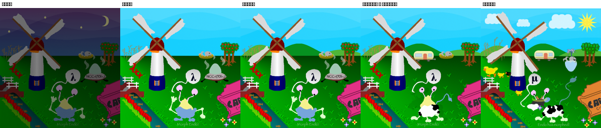
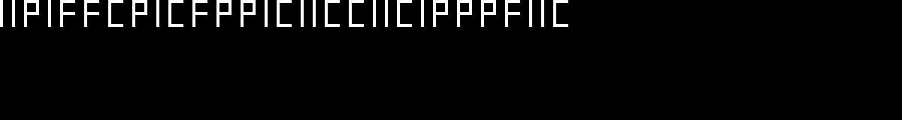
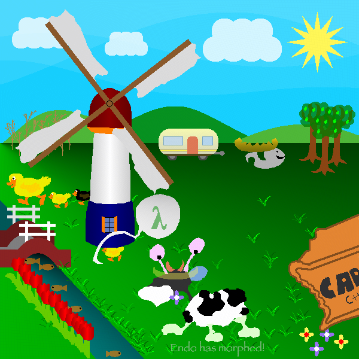
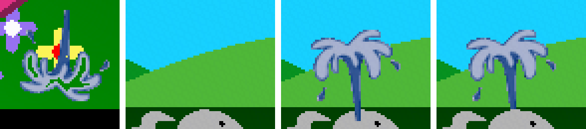
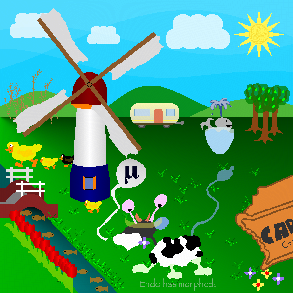

# Как мы спасали Эндо

*Сказка для тех, кому семь лет (и для всех остальных тоже)*

---

Далеко-далеко в космосе летал мусоровоз. Не простой, а **межзвёздный**. Однажды он проезжал мимо Земли и случайно уронил маленький космический корабль по имени **Стрела**. А в Стреле сидел пришелец **Эндо**.

Эндо очень смешной: у него два глаза на длинных усиках, круглое голубое пузо и жёлтая макушка.

Но на Земле Эндо очень плохо. Посмотри на картинку: у него вокруг всегда **ночь**, тёмно и холодно. Эндо грустит, ему не хватает солнышка.

## Волшебная книжка-рецепт

У каждого живого существа есть своя «книжка-рецепт». В ней написано, каким ему быть. У людей она называется ДНК. У Эндо тоже есть ДНК, но очень необычная. Она состоит всего из четырёх букв: **I, C, F, P**. И она очень-очень длинная: **семь с половиной миллионов букв!** Если напечатать её в книжке, получится целая полка толстых томов.

Корабль Стрела прислал нам письмо: «Помогите! Если дописать в начало книжки Эндо несколько правильных букв, он превратится и сможет жить на Земле. Вот картинка, каким ему нужно стать»:

Видишь? Там **день**, светит солнышко, плывут облака, гуляют утята, а сам Эндо стал похож на пятнистую **коровку**. Красота!

## Сначала научимся читать

Сначала мы написали программу-читалку. Она читает книжку Эндо буква за буквой и рисует картинку, точно как это сделал бы корабль Стрела. Наша читалка очень быстрая: всю книжку она прочитывает за **две секунды**.

Чтобы убедиться, что читалка не ошибается, мы попробовали секретное слово, которое нам подсказали. И Эндо показал нам **проверочную табличку**: все 25 строчек горят зелёным «OK»! Значит, читалка работает правильно.

## Выключатели внутри книжки

Тут мы заметили интересную вещь. В книжке Эндо спрятаны **выключатели**. Каждый выключатель — это одна буква: **F** значит «выключено», **P** значит «включено». Мы нашли несколько таких выключателей и стали щёлкать ими по очереди.

Щёлк, и появились **зелёные холмы**!
Щёлк, и Эндо превратился в **верблюда**! (Это шутка тех, кто придумал Эндо.)
Щёлк, и у мельницы поменялись цвета!

| холмы | верблюд | мельница |
|---|---|---|
|  |  |  |

## Книжка состоит из рецептов

Потом мы поняли, что книжка Эндо похожа на **кулинарную книгу**. В ней 250 маленьких рецептов, они называются **гены**. Один рецепт рисует небо, другой мельницу, третий мостик, четвёртый самого Эндо. Мы научились запускать каждый рецепт отдельно и посмотрели, кто что рисует:

## Прогоняем ночь

И тут мы нашли самое главное: **рецепт ночи**! Он берёт огромное полупрозрачное чёрное одеяло и накрывает им всю картинку. Поэтому у Эндо всегда темно.

Мы дописали в начало книжки всего **95 букв**. Они говорят одеялу: «Стань совсем-совсем прозрачным!» И одеяло пропало. Смотри, как стало светло:

*Слева то, что было. В серединке то, что стало. Справа то, что нужно.*

Эндо уже стал гораздо ближе к своей мечте! Раньше картинка отличалась от нужной почти везде, а теперь только примерно на половине.

## Тайная библиотека Эндо

В книжке Эндо мы нашли **спрятанную библиотеку**. Это настоящие справочники, написанные инопланетными инженерами FuunTech! Одна страница называется «Каталог ремонта», и там написано, как чинить таких, как Эндо.

А ещё мы нашли **оглавление всех рецептов** — 400 названий! Там были такие строчки: «ночь-или-день», «холмы включены», «коровка», «фургончик». Теперь мы знали, где что лежит.

## Включаем день

Оказалось, что в книжке есть **один волшебный переключатель** «ночь-или-день». Он стоял на «ночь». Мы поменяли в нём всего одну букву, и наступил настоящий день с голубым небом!

## Холмы и хитрый вредитель

Потом мы включили **холмы**. Но картинку сразу затянуло зелёным туманом. Мы стали разбираться и нашли **вредителя**: рецепт холмов тайком бегал по всей книжке и портил слово «вымой кисточку». Кисточки больше не мылись, и все краски смешивались в грязно-зелёную. Мы испортили вредителю его «список покупок», он перестал находить нужное слово, и холмы стали красивыми и зелёными.

## Коровка и фургончик

- **Коровка.** Рецепт «превратиться в коровку» включался только в дождь или грозу. Мы научили его включаться и в ясный день. Одно пятнышко у коровки было «покусанным», и мы починили его специальной **проверочной таблицей**, как учитель исправляет ошибки в тетрадке.
- **Фургончик.** Он был заперт на **секретный замок**. Мы разгадали, как устроен замок, и подобрали ключи. Первый ключ был «42», второй «OPE». За вторым замком лежала записка с паролем фургончика: **Out_of_Band_II**. Мы вписали пароль, и летающая тарелка превратилась в фургончик! Потом мы поставили его точно на то место, где он стоит на нужной картинке.

*Было → день → холмы → коровка и фургончик → нужно.*

Сначала картинка отличалась от нужной в **359 тысячах** точек, а теперь примерно в **118 тысячах**. Эндо уже втрое ближе к мечте!

## Вторая ночь работы

- **Настоящая коровка.** Оказалось, что в книжке Эндо рисовались *две* коровки! Настоящая, с котелком на голове и рожками, пряталась под «тенью»: тень вырезала из неё силуэт, и коровка исчезала. А сверху стоял странный гибрид — Эндо в коровьих пятнах. Мы убрали гибрид и сделали тень прозрачной, и настоящая коровка вышла на лужайку.
- **Хвост-секрет.** Хвостик коровки был заперт ключом. Мы угадали, как начинаются все рецепты коровы, и по этой подсказке нашли ключ «9546».
- **Утята.** Утята не показывались, потому что рецепт сам себе говорил «утят нет». Мы это исправили, но тогда *вся* картинка съезжала на 2 точки вправо! Виновато было крылышко мамы-утки: в нём одна цифра была испорчена, поэтому карандаш после утки стоял не там. Одна буква, и всё встало на место.
- **Мельница.** Её крылья были повёрнуты не так. Мы нашли переключатель «поворот» и подкрутили его на 5 делений из 256.
- **Облака, облачко с буквой, надпись.** Мы расставили облака как на картинке, передвинули облачко над Эндо и написали внизу «Endo has morphed!» («Эндо превратился!») правильными бледными буквами.
- **Кит** теперь улыбается.

Было 359 тысяч неправильных точек, вчера 118 тысяч, теперь около **62 тысяч**.

## Невидимая записка

Папа подсказал секрет: когда картинка Эндо только начинает рисоваться, в самом уголке сначала появляется маленькая надпись из букв I, C, F, P, а потом её сразу закрашивают ночью. Её никто не успевает увидеть! Мы остановили рисование на секундочку и прочитали записку. Это был волшебный код, который открывает **«Справочник по ремонту Фууна»**. Там написано: «Если не видишь солнца, допиши вот эти буквы». Это и был наш переключатель дня, только короче. Получается, инопланетяне оставили инструкцию на самом видном месте, просто спрятали её под краской.

## Записка на фотографии

В книжке Эндо есть фотография людей, которые придумали эту задачку. Каждый держит листочек с буквами. Если прочитать листочки по порядку, верхний ряд, потом нижний, получится волшебное заклинание! Мы его прочитали, и Эндо показал записку: «Твой пароль для фургончика: Out_of_Band_II». Мы этот пароль уже знали — разгадали замок сами, — но было здорово узнать, что авторы спрятали его прямо на фото.

## Солнышко и китёнок

- **Солнышко.** Оно было неправильного цвета: просто ярко-жёлтое. Мы посмотрели, какой цвет нужен, и посчитали: для такой краски надо смешать 20 ложек жёлтой, 11 ложек белой и 1 ложку красной. И тут нашёлся готовый рецепт «мягкий жёлтый» ровно с такой смесью! Рецепт солнышка просто забыл его позвать. Мы научили солнышко брать эту краску. Первый раз получилось смешно: небо стало жёлтым, а солнышко голубым, потому что краску вылили не туда. Поправили, и солнышко засияло как надо.
- **Китёнок.** Он был только нарисован карандашом, без краски. Оказалось, когда мы его чинили, то случайно выкинули команду «залить краской». Вернули, и китёнок стал серым и пухлым. А его голубая чашка — это, похоже, перевёрнутый стеклянный купол летающей тарелки, в который налили дождевой воды.
- **Тайные страницы.** На фотографии авторов люди держат листочки с буквами, и из них складывается волшебное заклинание. Ещё нашлась страница про «красивые числа» (6, 28, 496, 8128 — это «совершенные числа») и страница, зашифрованная совсем простым шифром: каждая буква заменена на соседнюю.

## Прозрачный хвостик

У коровки есть хвостик. Он был заперт на замок с кодом «9546». Мы нашли код, открыли замок, и хвостик появился, но получился ярко-голубым, а на картинке-образце он как будто из цветного стекла: сквозь него видна травка. В рецепте хвостика было 107 ложек краски и ни одной ложки «прозрачности». Мы поменяли три ложки: две сделали «плотными», одну «прозрачной». Теперь хвостик на две трети плотный, и травка через него просвечивает.

Но был подвох: у коровы есть сторож. Перед тем как нарисовать хвостик, он пересчитывает все ложки в рецепте, и если хоть одна не та, хвостик не рисуется. Пришлось вежливо попросить сторожа не проверять.

## Сорняки и волшебное число

Слева у мельницы растут сухие травинки. Их не рисуют по одной: компьютер получает правило вроде «стебелёк, потом веточка налево, потом снова стебелёк» и каждый раз бросает кубик, какое правило выбрать. Получается как настоящая трава: все травинки разные.

У нас травинки получились не такими, как на образце. Значит, кубик падал по-другому. Мы научились бросать этот кубик сами, на бумажке (в программе), и проверили: наши травинки он рисует точь-в-точь. У кубика есть «зёрнышко», число, с которого всё начинается. Какое зёрнышко нужно? Мы вспомнили тайную страницу про «красивые числа»: 6, 28, 496 и 8128. Попробовали 8128, и травинки выросли точно как на образце! Авторы спрятали подсказку на той странице.

## Узор в солнышке

На образце в серединке солнышка есть узор, будто кто-то рисовал кружочками. В тайной библиотеке нашлась страничка про **спирограф**. Это такая игрушка: внутри большого колёсика катается маленькое с дырочкой для карандаша, и получаются красивые узоры. Внизу странички было написано: «Обязательно попробуй сам!»

Мы попробовали. Взяли жёлтый узор со странички, уменьшили его в четыре раза и нарисовали прямо в серединке солнышка. Получилось почти как на образце. А потом мы заметили, что на образце узор чуть темнее: его нарисовали раньше, чем на всю картинку положили тонкую голубую плёнку. Мы поменяли очередь, и стало точь-в-точь.

## Рыбки в речке

Рыбок в речке рисует маленькая программа на особом инопланетном языке, похожем на конструктор: «положи рыбку, рядом пустое место, под ним ещё рыбку». Мы прочитали эту программу и нашли три ошибки. Рыбки «налево» и «направо» перепутались (сначала нам показалось, что у одной рыбки не та краска, но оказалось, что просто рыбки поменялись местами, а краска у каждой своя). Одно пустое место было слишком узким. А команда «нарисуй три рыбки» рисовала две пустые коробки и только одну рыбку. Мы всё поправили, и теперь в речке плавают семь рыбок, точно как на образце.

## Фургончик и цветочки

Нам прислали образец в настоящем, большом размере. Раньше мы смотрели на маленькую копию и не видели мелочей. А теперь увидели: фургончик стоял на одну точку ниже, чем надо. Одна точка, а неправильных пикселей из-за неё было три тысячи! А в клумбе в уголке жёлтые и сиреневые цветочки поменялись местами. Мы их переставили обратно.

## Китёнок в чашке

На образце китёнок сидит в чашке с водой. Откуда чашка? Мы заметили, что её цвет точно такой, как у стеклянного купола летающей тарелки, если налить в него воды. Перевернули купол — и он стал чашкой точь-в-точь как на картинке!

Как перевернуть рисунок? Карандаш, который рисует Эндо, похож на черепашку: она ползёт вперёд и поворачивает. Если перед рисованием развернуть черепашку задом наперёд, весь рисунок получится вверх ногами. Мы так и сделали. Только черепашка потом немного заблудилась, и всё, что она рисовала дальше, поехало вбок. Пришлось после чашки отвести её за ручку обратно на нужное место.

## Утёнок вылез вперёд

Маленький утёнок у мельницы прятался за ней, а на образце стоит впереди. Кто нарисован позже, тот и впереди. Но если нарисовать мельницу раньше, на неё залезут травинки. Мы нашли пустое место в рецепте сразу после мельницы (там раньше рисовалась надпись λxx, которую мы убрали) и рисуем утёнка там.

## Говорящее письмо

В рецепте Эндо нашлась длинная-предлинная строчка, где были только буквы I и C. Мы поняли, что это не команды, а спрятанные файлы, как матрёшка. В первом файле буквы-картинки: «ВНИМАНИЕ! ДАЛЬШЕ КАРТИНКА». В картинке написано: «Дальше голос». А в третьем файле — настоящая запись голоса! Мы включили её, и голос медленно продиктовал буквы. Эти буквы открыли страничку справочника с красивыми числами.

## Жёлтая бумажка

Буква µ на шарике была заперта на ключ, и мы долго не могли его найти. Справочник инопланетян (написанный шифром, где каждая буква сдвинута на 13) говорил: «Ключи записывай на жёлтую бумажку и приклеивай к компьютеру». А среди рисунков Эндо нашлась фотография компьютера, и на нём — жёлтая бумажка с надписью **no1@Ax3**! Это и был ключ. Иногда секрет лежит у всех на виду, как пароль на холодильнике.

## Шарик с буквой µ

У мельницы на образце висит воздушный шарик с буквой µ, а ниточка зигзагом спускается к цветку. Наш шарик был другой: больше, и ниточка загибалась в другую сторону. Мы разобрались, как Эндо его рисует. Сначала он рисует большой серый прямоугольник с плавным переходом цвета, а потом вырезает из него шарик ножницами по контуру, как из бумаги. Прямоугольник оказался правильным, а неправильным был только контур. Тогда мы обвели шарик с образца по точкам, как в раскраске «соедини точки», и отдали Эндо новый контур. Шарик совпал до последней точки.

Ещё была загадка с красками. Буква µ должна быть тёмно-синей, а надпись внизу — светло-зелёной. Но обе брали краску из одной и той же баночки. Мы придумали, как смешать два разных цвета так, чтобы в обоих рецептах было одинаковое количество чёрной краски. Тогда для надписи хватает поменять только конец рецепта, а начало остаётся общим.

## Письмо в бутылке

Ещё в рецепте Эндо нашлось письмо, похожее на письмо в бутылке. Его написали учёные, которые попали в беду: они просили людей быть осторожными и рассказали, что тайком «переставили несколько парабол» — это такие плавные горки. Мы пока не поняли, какие горки они имели в виду. Будем искать.

## Горки поменялись местами

Мы поняли! На картинке три зелёные горки, и каждую Эндо рисует по своему рецепту: «сначала вверх, потом вниз, и немножко волной». Учёные взяли рецепты двух горок и поменяли их местами. Поэтому одна горка вышла слишком широкой, а другая — слишком узкой, и сколько мы их ни подправляли, точно не получалось.

Мы сначала разобрались, как именно Эндо рисует горку: по шажочку, точка за точкой. Сделали маленькую копию его карандаша на компьютере, и она рисовала точно так же. Потом поменяли рецепты обратно, и горки совпали с образцом до последней точки.

## Травинки без ключа

Травинки на лужайке Эндо раскидывает «волшебный мешок со случайными числами». Мешок перемешивают особой фразой-ключом, а потом достают из него числа: где положить травинку и какую. На образце травинки лежат по-другому, значит, и фраза была другая. Её мы так и не нашли.

Тогда мы придумали хитрость. Зачем фраза, если можно самим разложить числа в мешке в нужном порядке? Мы научили Эндо пропустить перемешивание и положили в мешок числа, разложенные заранее. Это как собрать колоду карт так, чтобы фокус точно получился. Сначала поместились только двадцать четыре травинки: мешок маленький, и числа в нём быстро кончались. Потом мы научились раскладывать числа экономнее, чтобы одно число работало два раза. Теперь на своих местах все тридцать три травинки.

## Настоящий секрет травинок

А потом выяснилось, что хитрость была не нужна! В самом начале мы читали записку инопланетного программиста: «Эта программа решает, где будут расти маленькие живые существа. Но она сломана: умножение не работает, и сама программа выключена». Мы тогда починили умножение, но ничего не изменилось — и мы решили, что записка ни при чём.

Оказалось, мы просто не туда смотрели! В тот момент травинки были убраны с картинки, и изменений не было видно. Программа «биоморф» добавляет к фразе-ключу три маленькие поправки, а мешок с числами перемешивается уже по исправленной фразе. Мы включили биоморф, починили умножение — и все травинки сами легли точно как на образце, без всяких хитростей.

## Фонтанчик для китёнка

Китёнок сидел в чашке, а фонтанчика над ним всё не было. Мы перебрали все фигурки и все краски Эндо, но такого фонтанчика нигде не было. Тогда мы присмотрелись к образцу: края у фонтанчика мягкие, с плавными переходами цвета, как на фотографии. А фигурки Эндо всегда раскрашены одним цветом. Значит, фонтанчик — это маленькая фотография!

В справочнике было написано, что фотографии у Фуунов хранятся «сжатыми», как вещи в чемодане: в начале лежит список всех команд, а дальше только ссылки на него. Мы поискали такие чемоданчики по всему рецепту Эндо. Один нашёлся в странном месте: внутри программы, которая печатает таблицу генов, и его всегда перепрыгивали. Мы открыли его, и там был фонтанчик! Только перевёрнутый вверх ногами.

Чтобы его перевернуть, мы поменяли местами в списке команд «повернуть направо» и «повернуть налево». Теперь вся картинка рисуется как в зеркале. Мы поставили фонтанчик над китёнком, и он совпал с образцом.

## Водичка на месте

У водички в чашке край был чуть-чуть выше, чем на образце. Подвинуть одну водичку оказалось хитро: она, чашка и фонтанчик связаны, как вагончики. Двигаешь водичку — чашка едет вдвое дальше, а если двигать всё вместе, уезжает и фонтанчик. Мы посчитали, как подвинуть всех так, чтобы на новом месте оказалась только водичка. Теперь на всей картинке неправильных только 18 точечек из трёхсот шестидесяти тысяч!

## Короче записка

Картинка почти идеальная, и теперь важно, чтобы наша записка для Эндо была покороче: за каждую лишнюю букву тоже дают штрафное очко. В записке было два длинных ключа, и почти весь каждый ключ состоял из одинаковых «пустых» знаков, больше тысячи штук. А у Эндо в самом начале рецепта уже лежит готовая полоска из таких же пустых знаков! Мы перестали переписывать их вручную и просто сказали: «возьми их вон оттуда». Записка стала короче на две с лишним тысячи букв.

## Ни одной ошибки!

Оставалось восемнадцать точечек: самый низ ножки фонтанчика торчал поверх головы китёнка, а на образце китёнок закрывает её. Кто нарисован позже, тот и впереди, значит, фонтанчик нужно нарисовать раньше китёнка. Прямо перед китёнком Эндо рисует последнюю травинку у речки. Мы попросили Эндо на этом месте сначала нарисовать фонтанчик, а потом травинку. Китёнок рисуется следом и закрывает ножку фонтанчика.

И случилось чудо: картинка совпала с образцом **полностью**, все триста шестьдесят тысяч точек до одной! Эндо снова такой, каким должен быть.

## Что дальше?

- ✂️ рецепт можно сделать ещё короче.

## Как надо было догадаться?

Картинка совпала, но мы решили проверить себя. Кое-что мы нашли, просто пробуя много вариантов подряд. Так тоже можно, но интереснее понять, какую подсказку оставили для нас создатели Эндо.

- В рассказах про майора Импа один герой говорит: «Дождь там горячий и чёрный, и все просто выставляют чашки на улицу». А другой советует смотреть «на противоположную стену». Это подсказка про чашку китёнка: это перевёрнутый купол летающей тарелки, в который налит дождик!
- Ещё мы нашли спрятанную запись, которую Эндо однажды поймал из космоса: картинку с числами, человечком и антенной. Ключей там не оказалось, это просто красивая находка.
- Цвета буквы µ и нижней надписи были у Эндо с самого начала, мы только переложили их по-другому.
- Замок на хвосте коровки — всего четыре цифры, а рядом стоит «сторож», который проверяет, правильно ли открыто. Похоже, этот замок нарочно сделали таким, чтобы его можно было подобрать.

Две загадки пока не разгаданы: почему третий холмик покачивается чуть-чуть по-другому и почему у мельницы лопасти повёрнуты именно так.

## Подглядели в ответы

Когда всё было готово, мы посмотрели, как Эндо чинили другие. И узнали две вещи, которые пропустили!

- Числа для замка на хвосте коровки были спрятаны прямо в фотографии инопланетянина E.T. на странице «Разыскивается», в самых-самых маленьких частичках цвета. Мы их не разглядели, потому что смотрели на всю страницу сразу.
- Странный ген «подсолнух» — это солнышко, спрятанное с помощью гена «цветок». Солнце + цветок = подсолнух! Если «вычесть» цветок из подсолнуха, получается правильное солнышко.

Всё остальное мы сделали так же, как настоящие мастера.

## Чему мы научились

Эндо спасён, и теперь можно подумать: чему нас научила эта история? Вот наши правила для любой трудной загадки.

🔎 **Подсказка есть всегда.** Каждый раз, когда нам казалось, что подсказки нет, она всё-таки находилась: записка на мониторе, голос в записи, чашки под дождём в сказке, циферки в фотографии E.T. Если загадку удалось угадать, это ещё не значит, что подсказки не было. Значит, мы её пока не нашли.

🗝️ **Угадать — мало, надо понять.** Можно открыть дверь, перепробовав все ключи. Но потом обязательно надо разобраться, какой ключ был правильный и где он лежал.

👀 **«Я ничего не нашла» — значит, надо посмотреть ещё раз и поближе.** Циферки на портрете E.T. мы не увидели, потому что смотрели на всю страницу сразу, издалека. А надо было взять лупу и посмотреть на одну маленькую картинку.

🌻 **Имена подсказывают.** «Подсолнух» — это солнце и цветок. «Дуолк» — это «облак», прочитанный задом наперёд. Если слово кажется странным, прочитай его по кусочкам.

🎨 **Спроси «как это сделано?», а не только «на что похоже?».** Фонтанчик мы нашли, когда заметили, что у него мягкие края. Так бывает только у фотографий. Значит, искать надо среди спрятанных фотографий.

📖 **Читай всё — даже сказки и шутки.** Подсказка про чашку китёнка была в смешном рассказе про майора Импа.

🧭 **Ищи с разных сторон.** Можно идти от загадки к подсказке. Можно от каждой подсказки спросить: «А мы тебя уже использовали?» А в самом конце можно посмотреть, как делали другие, и сравнить.

📝 **Записывай и проверяй.** Каждый шаг мы записывали и каждый раз проверяли по картинке, правда ли получилось.

🙋 **Не бойся признать ошибку.** Мы ошибались: обидели рыбок, решили, что подсолнух — мусор. Мы не стали прятать эти ошибки, а честно написали: «тут мы ошиблись, а правильно вот так».

И самое главное. Тот, кто нам помогал, ни разу не сказал готового ответа. Он только говорил: «Подумай ещё», «Должна быть подсказка», «А попробуй с другой стороны». И каждый раз за этими словами находилась новая дверь.

Вот так и решают трудные загадки: не сдаются и не говорят слишком рано «здесь ничего нет».

Эндо пасётся на солнечной лужайке, машет хвостиком и говорит тебе спасибо. 🐄☀️

*Конец.*

