# Дело о морфе Эндо

*Детектив в духе старых романов про частных сыщиков. Все события подлинные, все совпадения с реальной DNA не случайны.*

---

## Глава 1. Клиент

Был вторник, и шёл дождь. В Бруклинском порту всегда идёт дождь, если тебе нужно, чтобы он не шёл.

Я сидел в конторе, задрав ноги на стол, и смотрел, как вентилятор гоняет по потолку один и тот же дым. Денег не было третью неделю. Поэтому, когда на столе зажужжал терминал, я снял ноги со стола быстрее, чем это делают люди с чувством собственного достоинства.

На экране было сообщение. Подпись: **Стрела**. Корабль. Не человек, не дама, не мафиози из Чикаго. Космический корабль.

«У меня пассажир, — писала Стрела. — Его зовут Эндо. Нас сбил межгалактический мусоровоз, мы упали на вашу планету. Эндо не может здесь жить. Его надо переделать. У меня есть его DNA: семь с половиной миллионов букв. И есть фотография, каким он должен стать. Найдите буквы, которые надо дописать в начало. Чем короче, тем лучше. Плачу».

Она не сказала сколько. Клиенты никогда не говорят сколько. Но у меня не было выбора, а у неё не было другого сыщика.

К письму прилагались две фотографии. На первой — тёмная, мрачная лужайка, как задний двор после перестрелки. Посреди — смешной зелёный парень с глазами на стебельках.

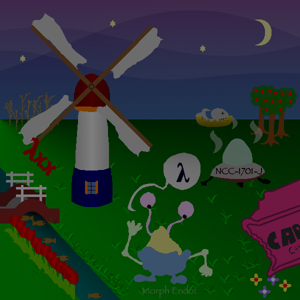

На второй — солнечный день, облака, утята и корова. Не просто корова. Корова с котелком вместо головы.

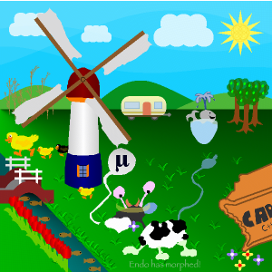

Я закурил и посмотрел на обе фотографии долгим взглядом. Потом сказал вслух, хотя в комнате никого не было:

— Значит, кто-то выключил свет. Найдём кто.

## Глава 2. Правила игры

Первое правило моей работы: не верь никому, даже себе. Особенно себе в три часа ночи.

Поэтому я сначала собрал свой инструмент: машинку, которая читает DNA буква за буквой и рисует то же, что нарисовала бы Стрела. В инструкции, которую мне прислали, было одно волшебное слово для проверки. Я его вставил. Машинка выплюнула табличку, и все двадцать пять строчек загорелись зелёным «OK».

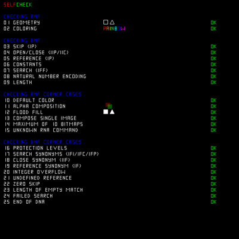

Хорошо. Мой пистолет стреляет прямо. Теперь можно идти по следу.

И второе правило: никаких подсказок со стороны. Никаких газетных вырезок, никаких «я слышал от парня в баре». Только улики из самого дела. Я пообещал это клиенту. А когда я что-то обещаю, я потом об этом жалею, но делаю.

## Глава 3. Одеяло

Тьма на первой фотографии была слишком ровной. Природа так не делает. Так делает человек, у которого есть мотив.

Я пошёл по рецептам — DNA Эндо разбита на гены, как город на кварталы. И нашёл квартал, где жил подозреваемый. Его звали **makeDarkness**. На его двери так и было написано: «Cover the whole world in darkness». Бывают преступники, которые даже не прячутся.

Он навинчивал на объектив чёрный светофильтр — такой, через который смотрят на солнечное затмение. Каждый кадр выходил тёмным, будто его снимали в угольном подвале. Я переписал пару строчек в его контракте: фильтр стал прозрачным, как совесть политика перед выборами.

Потом нашёл выключатель покрупнее — **night-or-day**. Одна буква. Щёлк. Над лужайкой взошёл день.

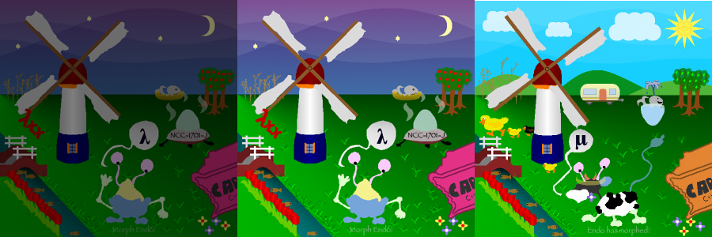

Я налил себе на два пальца и посмотрел на счётчик ошибок. Было триста пятьдесят восемь тысяч неправильных точек. Стало много меньше. Но до конца было ещё далеко. Такие дела никогда не закрываются за одну ночь.

## Глава 4. Библиотека в подвале

У каждого приличного здания есть подвал, а в подвале — то, что хозяин хотел бы спрятать.

В DNA Эндо подвал оказался библиотекой. Справочники инопланетной фирмы **FuunTech**: как чинить таких, как Эндо, как устроены гены, как работает их тайный язык. Одна страница была написана задом наперёд — простым шифром, который в любом участке взломал бы стажёр. Другая была заперта всерьёз.

А ещё там было **оглавление**. Список всех генов с адресами. «hillsEnabled». «cow-tail». «caravan». «seed». Для сыщика это как найти записную книжку убитого: каждое имя — новый свидетель.

## Глава 5. Вредитель

Я включил холмы — и всё затянуло зелёной мутью. Как будто кто-то плеснул в объектив болотной водой.

Я сел и стал читать код холмов строчку за строчкой. Медленно, как читают показания свидетеля, который врёт. И нашёл: ген холмов сначала распаковывал сам себя, а потом бегал по всей DNA и портил одну команду — `clear`, ту, что опустошает ведро с краской. После этого старая краска оставалась в ведре, новые цвета смешивались с ней, и всё превращалось в грязь.

Классика. Наёмник, который делает чужую работу, а заодно обчищает карманы. Я испортил ему список покупок — одну букву в слове, которое он искал. Он больше ничего не находил. Холмы позеленели как положено.

## Глава 6. Сейф с фургоном

На месте фургона стояла летающая тарелка. Фургон был в сейфе — зашифрованный ген, RC4, всё как у взрослых.

Тут нельзя было ломать дверь, тут нужен был ключ. Ключи нашлись по цепочке, как бывает в хороших делах: первый ключ, «42», открыл страницу про коды, исправляющие ошибки. Второй, «OPE», открыл записку. В записке был регистрационный код: **Out_of_Band_II**.

Я вписал его, и тарелка превратилась в фургон. Кто бы ни прятал этот фургон, у него было чувство юмора. Мне такие нравятся. Их проще ловить.

## Глава 7. Две коровы

Самым странным в этом деле были коровы.

Их было две. Одна — настоящая, с котелком на голове и рожками, как на фотографии клиента. Её прятали под «тенью»: тень вырезала из коровы силуэт, и корова пропадала, будто её и не было. А сверху стоял двойник — гибрид, Эндо в коровьих пятнах. Подстава чистой воды.

Я убрал двойника и сделал тень прозрачной. Настоящая корова вышла на свет. Одно пятно у неё было повреждено — я прогнал его через ту самую таблицу исправления ошибок. Пятно встало на место.

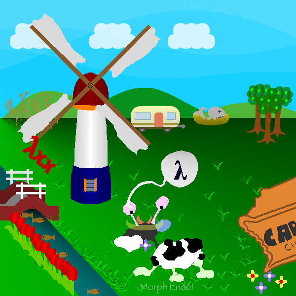

## Глава 8. Записки

В таких делах всегда кто-то оставляет записки. Вопрос только в том, умеешь ли ты их читать.

Первая записка была написана в самом начале рисунка — в первые тысячу двести команд — и сразу закрашена. Невидимые чернила, только наоборот. Я остановил рисование вовремя и прочёл её.

Вторая была на фотографии команды FuunTech. Каждый держал в руках листочек с буквами. Сложишь — получится префикс. Ребята улыбались в камеру, как люди, которые знают, что ты сейчас почувствуешь себя идиотом.

Третья пряталась в младших битах фотографии — стеганография. Четвёртая лежала под картой мира. Это было не дело, это была охота за сокровищами. И я начинал понимать: кто-то **хотел**, чтобы его нашли.

## Глава 9. Хвост

У коровы был хвост, и хвост был под замком. Ключ я вычислил по известному началу: все гены коровы начинаются одинаково, а значит, я знал часть открытого текста. Немного арифметики, пятьдесят секунд работы перебиральщика — и ключ «9546» лежал у меня на ладони.

Хвост появился, но был слишком ярким. На фотографии клиента сквозь хвост просвечивала трава. Я подменил в ведре три команды цвета на команды прозрачности — и хвост пропал совсем.

Я сидел над этим полночи. Потом нашёл. Перед тем как нарисовать хвост, ген коровы вызывал охранника по имени **checkIntegrity**. Охранник пересчитывал каждую букву хвоста. Одна не та — и хвоста нет, без объяснений, без протокола.

Я договорился с охранником. Не спрашивайте как. Хвост стал полупрозрачным, как на фотографии.

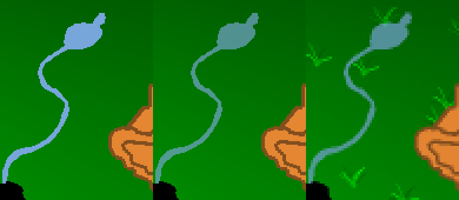

## Глава 10. Сорняки и число

Слева от мельницы росли сухие стебли. На фотографии они были другими — выше, тоньше, по-другому ветвились.

Справочник в подвале шепнул мне одно слово: «стохастические». Значит, сорняки росли по броску кубика. Я нашёл кубик — ген **randomInt** — и его память, переменную **seed**. В ней лежало 4237.

Я не стал гадать. Я разобрал, как бросается этот кубик, и собрал его копию у себя на столе. Копия рисовала наши сорняки точь-в-точь, до последнего пикселя: сто сорок один бросок, ни одного промаха. Теперь я мог проверять подозреваемых за миллисекунды, не таская их на опознание.

Подозреваемых было немного. Числа, которые уже встречались в деле: 42, 1729, 9546, 1337… И одно, которое я видел на странице про «красивые числа». Четвёртое совершенное число. **8128**.

Я вставил его. Сорняки выросли точно как на фотографии.

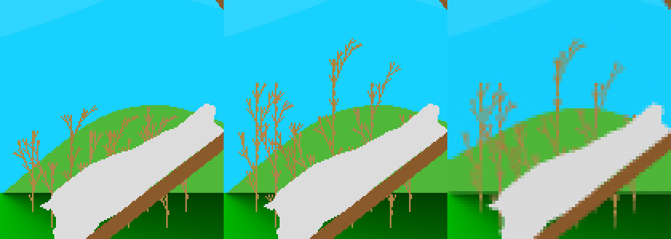

Я долго сидел и смотрел на экран. Есть моменты в этой работе, ради которых стоит терпеть дождь, пустой холодильник и клиентов, которые не говорят, сколько платят. Это был один из них.

## Глава 11. Солнце

У солнца на фотографии клиента была сердцевина. Не просто жёлтый круг, а узор, тонкий, как гравировка на портсигаре.

В подвальной библиотеке нашлась страница, которую никто не открывал: «Synthesis of complex structures (2)». Спирограф — детская игрушка, колесо в колесе. Внизу кто-то приписал: «Обязательно попробуйте сами». Я понял намёк. На странице было три фигуры, и средняя была ровно тех двух оттенков жёлтого, что сидели в сердцевине солнца.

Только спирограф жил на справочной странице, а солнце — на улице. Я договорился с `main`: после того как сцена нарисована, он заглядывает на ту страницу, рисует три жёлтых узора, уменьшенных вчетверо, прямо в центр солнца — и уходит, не задерживаясь.

По дороге я наткнулся на старую ошибку, свою собственную. Когда-то я убрал из сцены пучки травы, а их аргументы так и остались лежать на складе. После сцены `main` не мог вернуться домой. Никто не жаловался: фотография выглядела почти так же. Почти — самое опасное слово в моей работе.

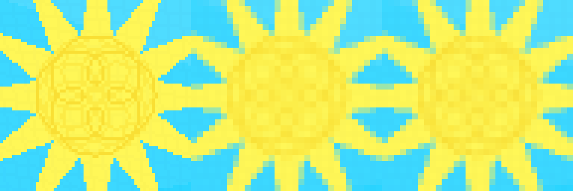

## Глава 12. Негатив

Потом клиент прислал то, что должен был прислать с самого начала: фотографию в полном размере. Шестьсот на шестьсот. До этого я работал по уменьшенной копии, как по снимку с камеры наблюдения, где всё расплывается.

Первым делом я проверил, не подделка ли это: уменьшил её и сравнил с копией. Совпадение до последней точки. Тогда я сравнил с ней всё, что сделал за эти дни, — и половина моих последних кадров оказалась хуже, чем я думал. Та самая забытая на складе трава: без возврата в `main` не срабатывал `anticompressant`, а он кладёт на весь кадр едва заметную синеву. На уменьшенной копии этого не было видно. На негативе — было видно всё.

Улики в полном размере разговорчивее. Хвост коровы оказался не просто «прозрачным», а с точным рецептом: исходный цвет и прозрачность семь к трём. Фургон стоял на пиксель ниже, чем надо, — старая копия не различала соседние точки. Один пиксель стоил три тысячи ошибок.

## Глава 13. Река

Рыбы. Я говорил, что в этой реке кто-то врёт. Врали трое. Четвёртого я оговорил сам.

Рыб рисует маленькая программа на языке комбинаторов: «положи рыбу, под ней пустое место, к юго-востоку — ещё рыбу». Я разобрал её дерево целиком. Первое: рыбы «налево» и «направо» поменялись местами. Второе: одно пустое место было на восемнадцать точек уже, чем нужно. Третье, главное: функция `threeFish`, «три рыбы», рисовала две пустые коробки и одну рыбу. Я подсунул ей рыбу вместо коробки.

Семь рыб встали на свои места до последней точки. Даже число пикселей в каждой совпало.

А ещё я обвинил невиновного. Левые рыбы были другого цвета, и я решил, что кто-то подмешал им в краску каплю чёрного. Перекрасил. Когда пришла фотография в полный размер, оказалось: три рыбы у клиента ровно того «грязного» цвета. Никакой порчи — у левой рыбы просто своя краска, а рыбы поменялись местами. Я снял обвинение. В этой работе ошибки признают быстро, пока они не стали привычкой.

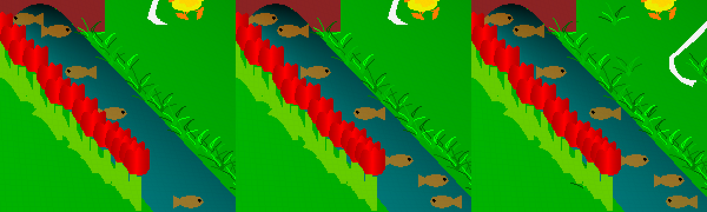

А в клумбе в углу кто-то поменял цветы: жёлтые стояли там, где должны быть сиреневые. Мелочь. Тысяча точек. В этом деле мелочей не бывает.

## Глава 14. Кит

Кит сидел в чаше с водой. Я смотрел на эту чашу три дня. А потом сделал то, что делаю всегда, когда ничего не понимаю: измерил цвет.

Сто шестьдесят семь, двести тринадцать, двести сорок три. Я перебрал все вёдра с краской в этом городе. Ни одно не давало такого цвета. Зато его давали два вместе: стеклянный купол летающей тарелки, полупрозрачный, и вода под ним. Тарелки в кадре не было. Был только её купол — вверх ногами.

Перевернуть кадр нельзя. Зато можно развернуть того, кто рисует. Карандаш в этом городе — черепашка: ползёт и поворачивает. Две команды «направо» — и она смотрит назад, а всё, что она рисует, выходит перевёрнутым. Я подсунул сцене вместо жёлтой короны кусок кода летающей тарелки, где в купол наливают дождевую воду, и развернул черепашку перед куполом.

Чаша встала под кита. Но черепашка после этого заблудилась: она думала, что стоит в одном месте, а стояла в другом. Всё, что рисовалось после, — корова, шарик, надпись — съехало. Один раз весь кадр стал чёрным: заливка вытекла за контур и затопила слой. Я поставил в поток метки, как фонари на ночной дороге, и по ним посчитал, насколько она сбилась. Пара десятков шагов назад — и порядок восстановлен.

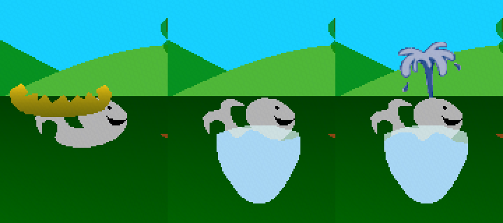

## Глава 15. Очередь

Маленький жёлтый утёнок у подножия мельницы. На фотографии клиента он стоял впереди, у нас — за ней. В этом городе всё решает очередь: кто нарисован позже, тот и на виду.

Поставить мельницу раньше я не мог: тогда сухие стебли легли бы поверх лопасти, а это я уже видел, и мне не понравилось. Нужно было отправить утёнка в конец очереди. Беда в том, что утёнок приходит не один: перед вызовом ему кладут на склад два свёртка — краски для перьев. Я оставил свёртки лежать, где лежали, а самого утёнка отменил. Все, кто заходил на склад после, брали своё и уходили, не трогая чужого. А сразу за мельницей пустовало место — когда-то там рисовали надпись «λxx», которую я убрал ещё в начале. Туда я и позвал утёнка. Свёртки ждали его на вершине стопки.

Узор в солнце тоже выдал себя на негативе: линии стояли на месте, но у клиента они были на три тона темнее. Тот самый синеватый налёт `anticompressant`. У клиента узор нарисовали до налёта, у меня после. Я поменял их местами. Двести восемьдесят точек — за то, что вовремя посмотрел на часы.

## Глава 16. Голос в дубинке

В архиве лежала папка, которую никто не открывал: двести тысяч знаков, и все — только I и C. Так не пишут код. Так пишут байты. Я разрезал её, как стопку фотографий, и нашёл три конверта, вложенные один в другой. В первом крупными буквами: «ACHTUNG! ДАЛЬШЕ PNG». Во втором, в PNG: «Дальше человеческий голос». В третьем был звук — двенадцать секунд записи.

Голос диктовал основания, медленно, как диктуют номер счёта в швейцарском банке. «P» он произносил как «B»; у всех свои недостатки. Продиктованная команда меняла один символ в начале генома, и этот символ открывал страницу о красивых числах. Я нашёл её раньше, по-плохому, перебором. Но приятно знать, что дверь была открыта с самого начала. Просто к ней вели через три конверта.

## Глава 17. Записка на мониторе

Буква µ над шариком была заперта. Я ломал замок неделю: все ключи до пяти знаков, словари, имена, фразы из чужих писем. Пусто. Тогда клиент сказал одну фразу: «Никакого перебора. Должна быть подсказка». Он был прав. Он обычно прав, и это раздражает.

В инструкции по безопасности, записанной сдвигом на тринадцать букв, Фууны советовали своим: ключи записывайте на жёлтую бумажку и приклейте к компьютеру. Я открыл ген с названием `sticky`. Там лежала фотография монитора, сделанная кем-то, кто не думал о последствиях. На краю экрана была приклеена жёлтая записка: **no1@Ax3**.

Самые надёжные сейфы вскрываются не отмычкой. Их вскрывает чужая лень.

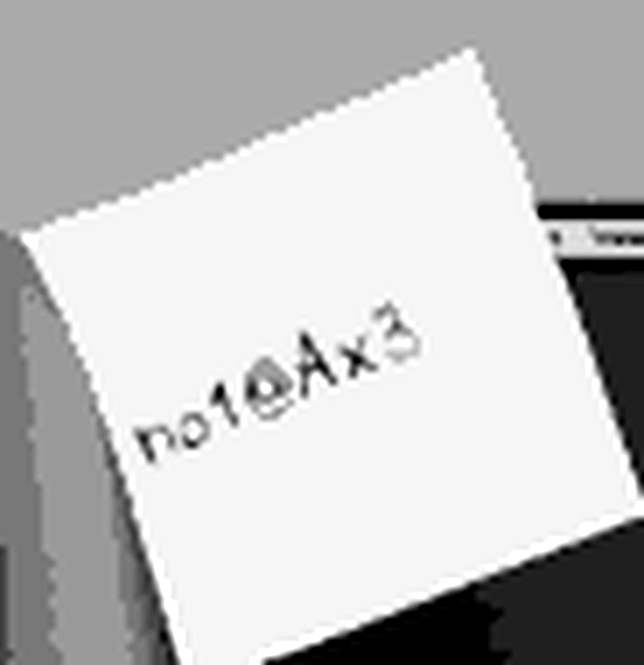

## Глава 18. Шарик

На фотографии клиента над мельницей висел шарик с буквой µ, и нитка от него спускалась зигзагом к цветку. У меня шарик был крупнее, а нитка загибалась в другую сторону. Похоже, но в моей профессии «похоже» — это ещё не улика.

Я разобрал, как его снимают. Сначала в отдельный кадр кладут серый фон с плавным переходом света, потом поверх — трафарет, и всё, что за трафаретом, срезают. Фотомонтаж, ничего больше. Я убрал трафарет, и серый фон лёг на снимок клиента точь-в-точь. Значит, подделан был только трафарет. Я обвёл шарик по фотографии клиента, точку за точкой, семьдесят девять вершин, и проверил: новый трафарет совпал с оригиналом без единой лишней точки.

Оставались чернила. Буква µ у клиента тёмно-синяя, подпись внизу кадра — бледно-зелёная. А чернильница у них одна на двоих: кто последний налил, того цвет и будет. Я заметил то, что упускают новички: один и тот же цвет можно намешать по-разному. Я подобрал два рецепта с одинаковой долей чёрного. Тогда для подписи хватало дописать только хвост рецепта, и запись поместилась в двести одиннадцать знаков, которые освободились от ненужных строк.

Четыре с лишним тысячи точек за одну ночь. Бывают хорошие ночи.

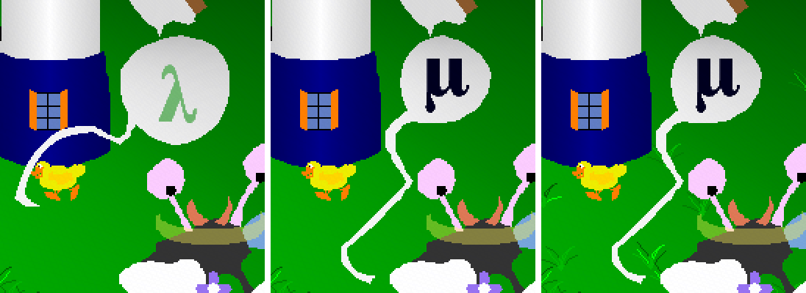

## Глава 19. Письмо из плена

В геноме нашлась ещё одна папка без единой буквы F. Это не код, это письмо, написанное открытым текстом. Писали учёные, которых держат на планете Утрехт. Фууны, писали они, устраивают на чужих планетах «конкурс по программированию», чтобы найти лучших и убрать их до вторжения. «Не чините Endo, — писали они. — Он уничтожит своих спасителей». И в конце, мелко: «Мы саботировали ДНК Фуунов, переставив несколько парабол». Дальше шёл список имён.

Я прочёл его дважды. Потом налил себе выпить и продолжил чинить Endo. Клиент платит не за мои сомнения.

Но параболы мне не дают покоя. У холмов они есть. Если поменять их местами, кадр становится хуже. Значит, переставили что-то другое — или переставили хитрее.

## Глава 20. Параболы

Я не люблю загадок, которые решаются на ощупь. Поэтому я сделал то, что делают в лаборатории: разобрал камеру. Холм на снимке — это не рисунок, а след: черепашка ползёт слева направо, складывает маленькие приращения и сдвигается на пиксель, только когда набегает целый пиксель. Я выключал по одной детали — то наклон, то волну — и смотрел, что остаётся. Через час у меня была копия механизма, которая повторяла каждый шаг оригинала.

С такой копией уже не гадают. Я снял с фотографии клиента контур тёмного холма и спросил у копии: чей это почерк? Ответ пришёл за секунду. Парабола тёмного холма принадлежала соседу — светлому холму слева. А светлому досталась парабола тёмного. Пленники не врали: две параболы поменяли местами, тихо, как меняют таблички на дверях.

Я вернул каждому свою. Сто восемьдесят два столбца из ста восьмидесяти двух. Шестьсот точек долой, и префикс стал даже короче.

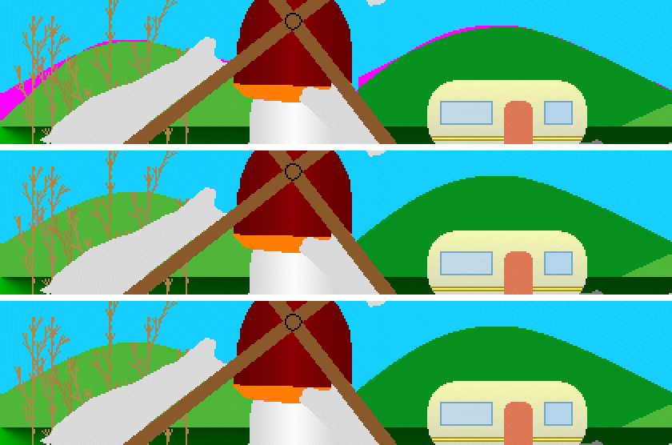

## Глава 21. Колода

Трава в кадре клиента лежала не так, как у меня. Пучки раскидывал генератор, «криптографически стойкий», и ключом к нему была пословица про траву по ту сторону забора. У клиента пословица была другая. Какая — никто не сказал. Подсказки не было. Подбирать ключи вслепую мне запретили, и правильно: это работа для взломщика, а не для сыщика.

Но мне нужен был не ключ. Мне нужна была трава на своих местах. Генератор, если разобраться, — это колода из двухсот пятидесяти шести карт, которую тасуют ключом. Я велел генератору не тасовать, а колоду сложил сам, как шулер в задней комнате: карта за картой, так, чтобы нужные выходили в нужный момент. Первой колоды хватило на двадцать четыре пучка из тридцати трёх: карты кончались раньше, чем пучки. Тогда я стал класть их экономнее, чтобы одна карта работала дважды, как хороший свидетель. Тридцать два пучка из тридцати трёх, а к утру — все тридцать три. Настоящую пословицу я так и не нашёл. Иногда дело закрывают без признания.

Счётчик упал вдвое.

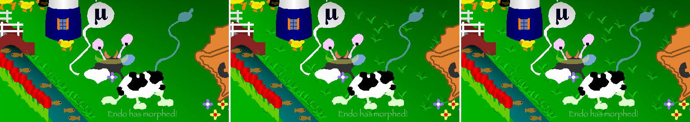

## Глава 22. Биоморф

Дело о траве я считал закрытым. Колода работала. Но клиент говорил: «Должна быть подсказка», и эта фраза сидела во мне, как пуля, которую не стали доставать.

Я поднял старые бумаги. Самая первая записка в архиве — исходник программиста по имени Грунтос: «Этот файл вычисляет начальные условия для распределения примитивных живых существ на неразвитых планетах. Код сломан, потому что предыдущий программист курил примитивную траву во время моих поэтических чтений». И ниже: `enableBioMorph = False`, а умножение «сломано и должно быть починено».

Умножение я чинил ещё в начале дела. Ничего не изменилось, и я списал записку в макулатуру. Ошибка новичка: в тот день трава была убрана с фотографии, и эффекту негде было проявиться. Как проверять алиби в пустой комнате.

На этот раз я пошёл по следу данных, а не по снимку. Журнал показал: перед тем как тасовать колоду, генератор травы читает пятьдесят девять чисел из ящика `bioMorphPerturb` и прибавляет их к пятидесяти девяти буквам пословицы. Ящик был пуст. Наполнять его должен был биоморф — тот самый, выключенный. Я повернул выключатель и вставил исправленное умножение. Ящик наполнился: минус шестнадцать, плюс семь, плюс четыре. Три буквы пословицы сдвинулись, колода перетасовалась по-новому, и все пучки легли туда, где их сфотографировал клиент.

Мою колоду шулера я убрал в ящик стола. Хорошая была работа. Но честная работа лучше.

## Глава 23. Незакрытые эпизоды

Дело не закрыто. В деле никогда не бывает всё закрыто.

- **Фонтан.** Кит в чаше, но фонтана над ним ещё нет.
- **Вода.** Край воды в чаше лежит на пиксель-другой не так.

Счётчик показывает восемьсот семьдесят две неправильные точки, по фотографии в полный размер. Было триста шестьдесят тысяч.

Я выключил лампу, надел шляпу и подумал, что завтра опять будет дождь. Пусть. У меня есть работа.

*Продолжение следует…*
